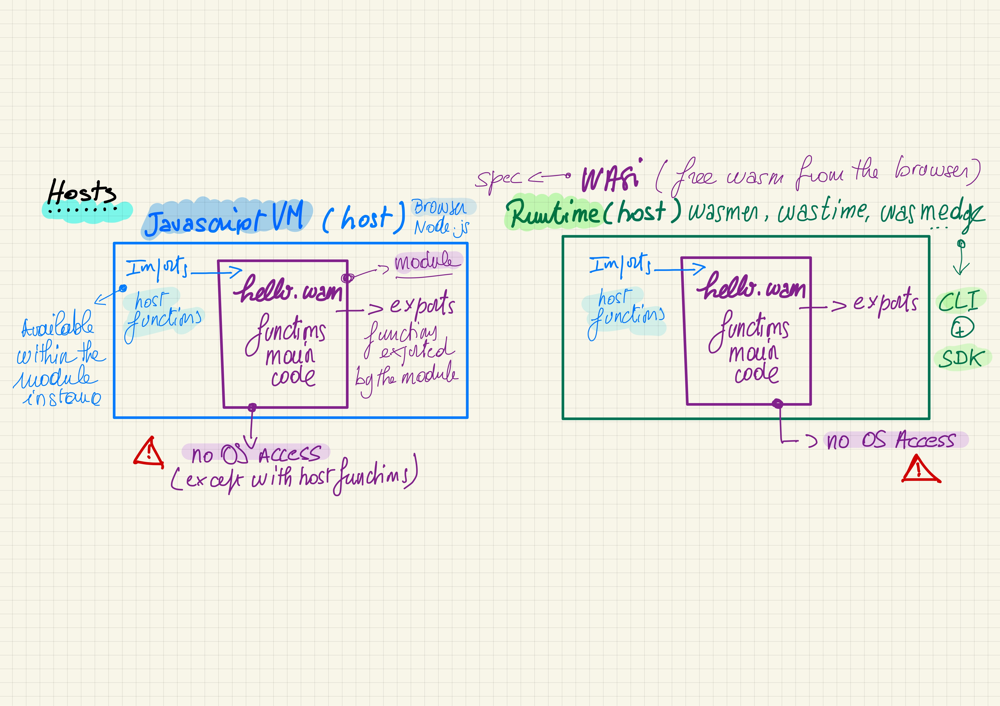

###### Wasm file (module) ~= container image, <mark>smaller</mark>, safer, without an OS

<!-- la portabilité de wasm dépend de l'hôte
l'hôte exporte des fonctions (utilisable par le module qui les importe)
le module exporte des fonctions utilisables par l'hôte
-->

---
