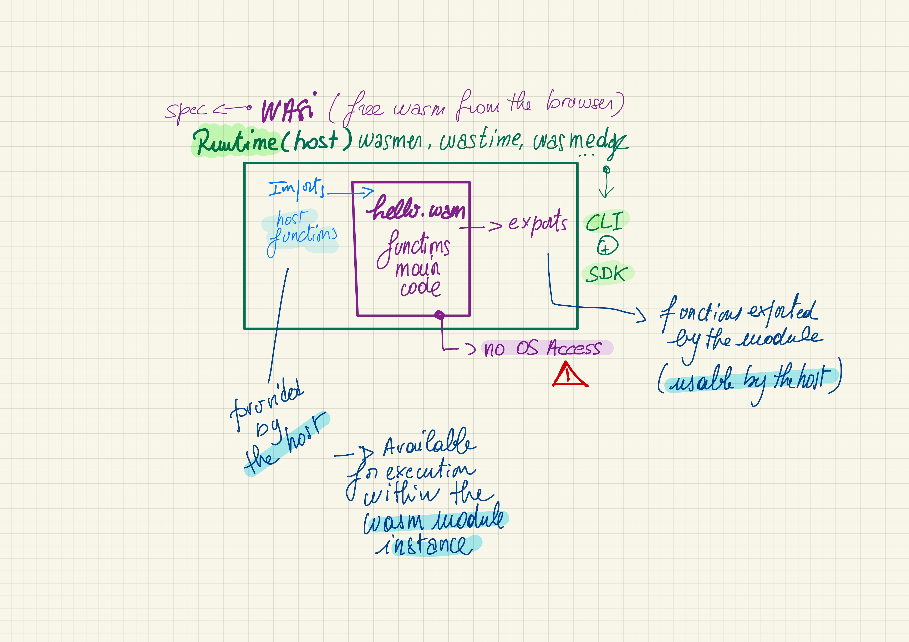

#### Les 3 les plus reconnus du moment :

- **Wasmer**: https://wasmer.io/
- **Wasmtime**: https://wasmtime.dev/
- **WasmEdge**: https://wasmedge.org/

#### 2 fonctions :

- **CLI** : pour exécuter du code Wasm à partir d’une CLI
- **SDK** : pour exécuter du code Wasm à partir d’un autre langage (Rust, Go, C/C++)

---

###### Principe du Host Runtime

---

##### SDK WASI / Langage <mark>(<> CLI)</mark>

Langage             | WASMER                   | WASMEDGE (+arm)           | WASMTIME (+arm)
:-------------------|:-------------------------|:--------------------------|:--------
  <mark>Rust</mark> |  x                       |  x                        |  x
  <mark>Go</mark>   |  x (<mark>TinyGo</mark>) |  x  (<mark>TinyGo</mark>) |  x (<mark>TinyGo</mark>)
  <mark>C</mark>    |  x                       |  x                        |  x
  C++               |  x                       |                           |
  Python            |  x                       |  x                        |  x
  Swift             |  x                       |  x                        |  ?
  Grain             |                          |  x                        |  ?
  .Net              |  x (C#)                  |                           |  x
  NodeJS            |  x                       |  x                        |
  Bash              |                          |                           |  x
  Java              |  x                       |                           |  x (outside Bytecode Alliance)
  Perl              |                          |                           |  x (outside Bytecode Alliance)
  Zig               |  x (not published)       |                           |  x (outside Bytecode Alliance)
  Ruby              |                          |                           |  x (outside Bytecode Alliance)
> *Wasmer supporte d'autres langages*

---

