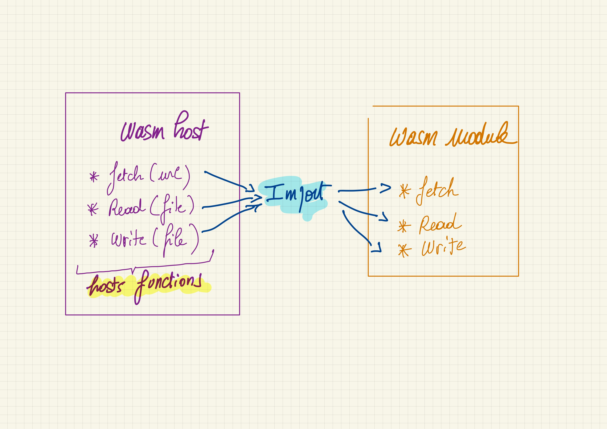

#### Mais il y a toujours les même limitations 😢

- **Système de type trop simple**
  - <mark>Seulement 4 types numériques</mark> :
    - Integers (32 & 64 bit)
    - Floats (32 & 64 bit)
  - <mark-invert>Passer une `String` à une fonction n'est pas trivial 🥵</mark-invert>

- **Mode d’exécution fermé du module Wasm**
  - <mark>Pas d’accès à "l’extérieur"</mark> :
    - Pas d’appel http
    - Pas d’accès fichier
    - ...
  - <mark-invert>Il est possible de définir des **host functions**</mark-invert>
    - <mark-invert>mais ce n'est pas simple 🤬</mark-invert>

---

#### Comment contourner ces limitations
##### "the hard way"

- Passage de **Strings** à une fonction avec **WasmEdge**
  - Pass complex parameters to Wasm functions: https://wasmedge.org/book/en/embed/go/memory.html
- Création de **Host Functions** avec **WasmEdge**
  - https://wasmedge.org/book/en/extend/plugin/hostfunction.html#host-functions

---

## Mais : à venir

<mark><b>Interface Types</b></mark> : décrire des types de plus haut niveau, éviter les frictions

https://hacks.mozilla.org/2019/08/webassembly-interface-types/

---
###### Principe des host functions

---

