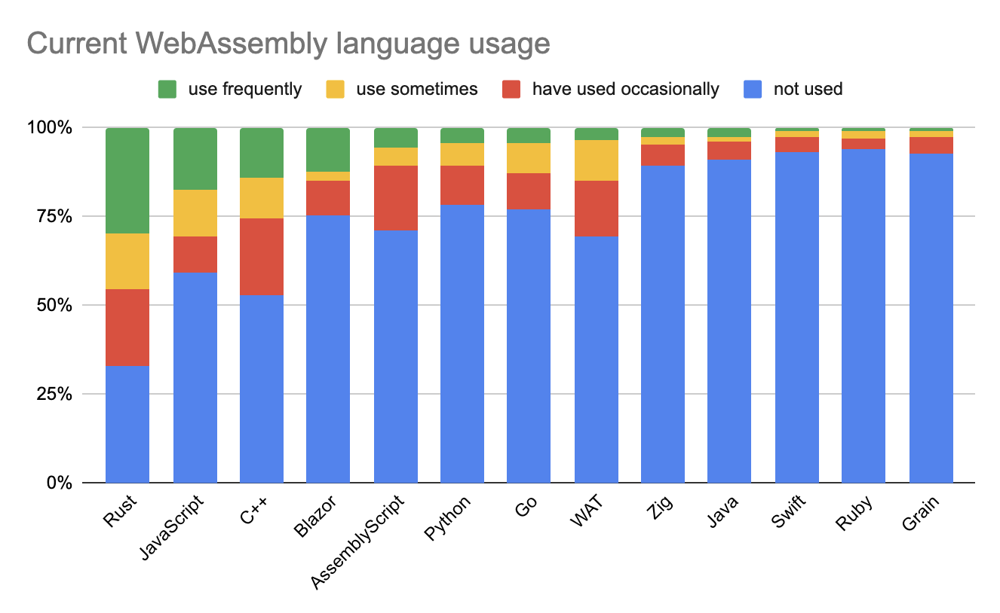
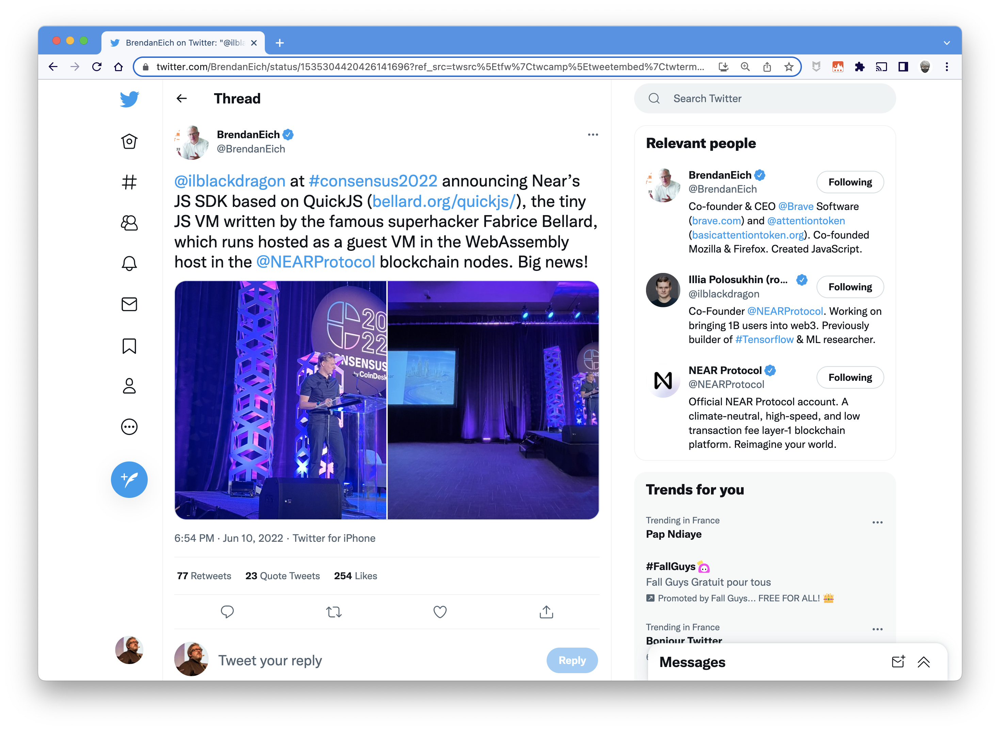
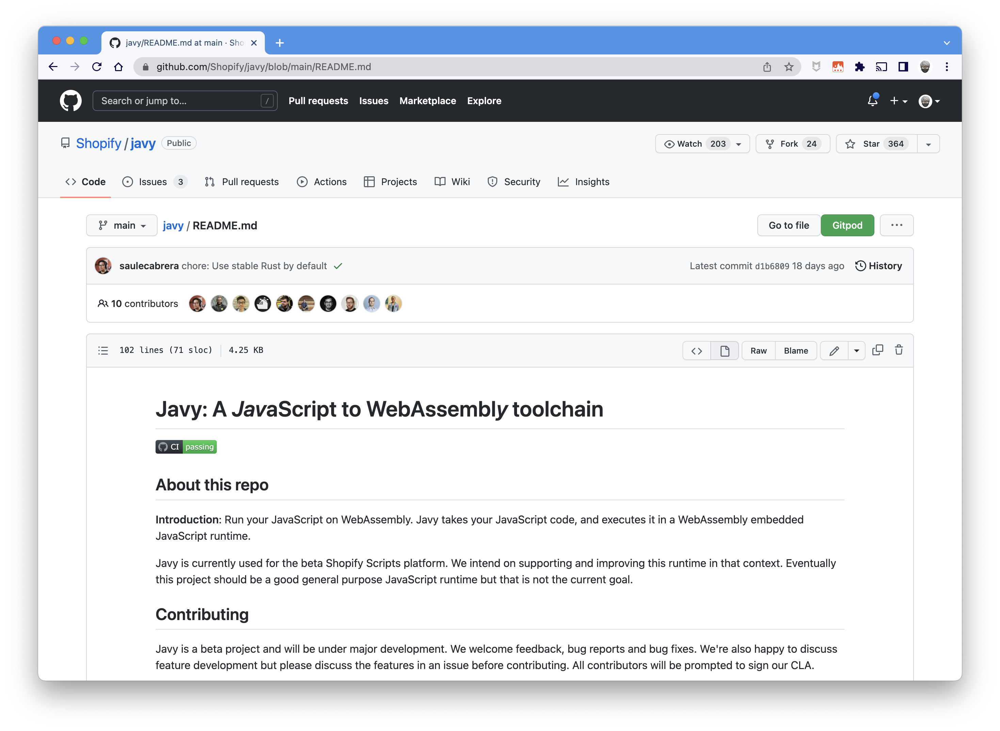
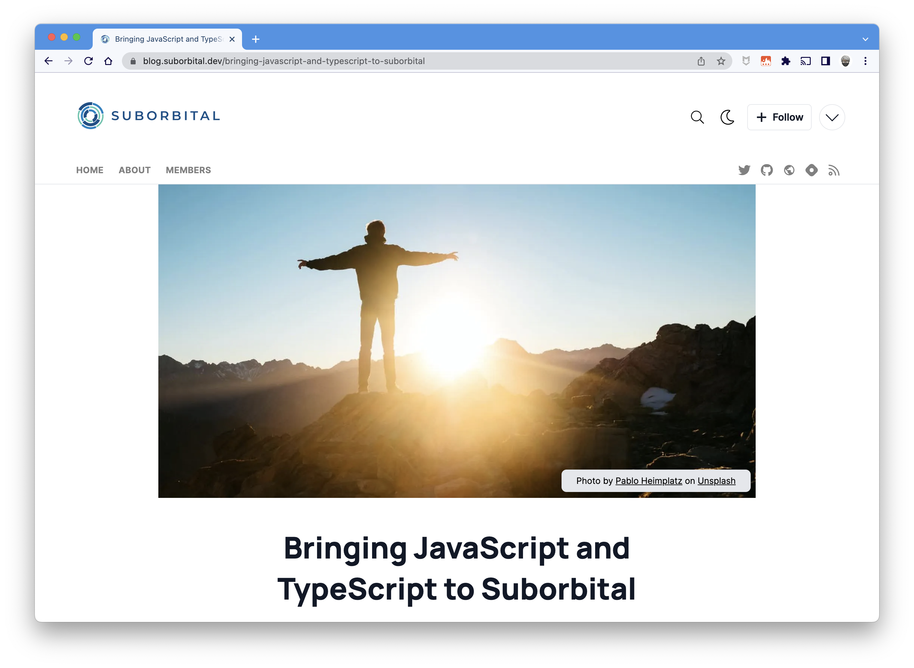

<style scoped>
  mark {
    background-color: #942EC1;
    color: #FFFFFF;
  }
</style>
# Petit cours de <mark>Wasm</mark> front/back par l'exemple

🦩 **SunnyTech 2022** 🦩

https://github.com/wasm-university/sunny-tech-2022

---
# Merci 😃

**à vous & à l'équipe SunnyTech 🥰**

---


#### Philippe Charrière

- TAM @GitLab
- 🤖 Bots.Garden
- 🦊 @k33g
- 🐦 @k33g_org
- 🍊🦸Gitpod Hero
- GDG Cloud IOT Lyon
- RdV des speakers

---
# Déroulement

- 👋 Vous pouvez intervenir à tout moment
- 10% Théorie 90% Démos (en gros)
- 🚀 Des démos que vous pourrez refaire :
  - https://github.com/wasm-university/sunny-tech-2022
  - en utilisant <mark>Gitpod</mark>
  - ou en utilisant <mark>DevContainer</mark>

---
# Objectif(s)

- Une présentation "découverte" par l’exemple
- Rien de complexe
- Repartir avec le bagage nécessaire 🧳

🖐️ Ne posez pas de questions compliquées 😛🙏
https://github.com/wasm-university/sunny-tech-2022/issues

---
# Une petite remarque ...

- Faire choisir le langage au démarrage 🤔
- En fait **Wasm** est polyglotte
- Donc la prez est polyglotte
  - ... Et j'ai galéré en **Rust** sur certains exemples compliqués 🥵

---

# WebAssembly ???

## WASM ???
### C'est parti ! 🚀

---
###### Wasm Quoi/Pourquoi ?


---
###### Histoire


---

## Wasm peut s’exécuter partout

- JavaScript (navigateur)
- JavaScript (Node.js)
- GraalVM
- Runtimes **WASI** (Wasmer, Wastime, Wasmedge, …):
  - *CLI & Libs/Frameworks*
  - > WASI = webassembly system interface

---

###### Wasm file (module) ~= container image, <mark>smaller</mark>, safer, without an OS


<!-- la portabilité de wasm dépend de l'hôte
l'hôte exporte des fonctions (utilisable par le module qui les importe)
le module exporte des fonctions utilisables par l'hôte
-->

---

# Wasm a "quelques" limitations

---

### 🖐️ Le module Wasm n’accède pas à l’OS

- Wasm c’est pour du compute (au départ)
- Pas d’accès aux fonctions systèmes de l’OS (hors host functions)
  - I/O
  - Sockets
- Pas d’accès à la mémoire hors allocation spécifique
<!-- vérifier cette partie -->

---

## <mark>Safe by default</mark>

### C'est une bonne limitation

---
### 📣 La Communication Wasm <=> Host  n’est pas triviale
> (trop bas niveau ?)

#### 4 types de données pour les paramètres:

  - 32 & 64 Bit Integer
  - 32 & 64 Bit Floating-Point Number

---
## String 😡

> Mais ...
> - Certains "hôtes" (et toolchains) ont déjà tout prévu
> - Certains frameworks par-dessus WASI *(WebAssembly System Interface)*

---


# 🛠 ToolChains

---
##### Toolchains par langage & hôte ⚡️⚡️

<style scoped>
table {
    height: 80%;
    width: 100%;
    font-size: 20px;
    color: green;
}
th {
    color: blue;
}
mark {
  background-color: #EFD217;
  color: #000000;
}
mark-bis {
  background-color: #000000;
  color: #EFD217;
}
</style>

Langage         | WASM (VM JS)                    | WASI                                     | Remarks
:---------------|:--------------------------------|:-----------------------------------------|:--------
<mark>C/C++ </mark>          | EMScripten, LLVM (clang)        | LLVM, SDK C/C++ Wasmer                   |
<mark>Rust</mark>            | Wasm-pack + wasm-bindgen (glue) | rustup target add wasm32-wasi            | <mark>support navigateur</mark> 💖
<mark-bis>Go</mark-bis>              | Intégré à la toolchain standard | Non ou alors utiliser TinyGo             | <mark>support navigateur</mark> 💖
Assemblyscript  | Intégré                         | Intégré                                  | Ne cible que du WASM
Swift           | SwiftWasm                       | SwiftWasm                                |
Kotlin          | Kotlin native (expérimental)    |                                          |
C#              | Blazor (solution complète)      | <mark>dotnet add package Wasi.Sdk --prerelease</mark> |
Ruby            | Artichoke                       | En cours (portage CRuby Wasm32-WASI)     |
Python          | Expérimental                    |                                          |

<!-- regarder prez de Sébastien pour Kotlin -->
###### *Liste non exhaustive*

---

# Statut actuel de Wasm

https://blog.scottlogic.com/2022/06/20/state-of-wasm-2022.html

---



---
<style scoped>
mark {
  background-color: #EFD217;
  color: #000000;
}
mark-purple {
  background-color: #942EC1;
  color: #FFFFFF;
}

mark-orange {
  background-color: #F0B044;
  color: #000000;
}

mark-cyan {
  background-color: #44F0EF;
  color: #000000;
}

mark-grey {
  background-color: #E2E0D6;
  color: #000000;
}

mark-green {
  background-color: #71F09C;
  color: #000000;
}

</style>

#### (Très) Rapide résumé (issue du sondage)

- L'utilisation de <mark-purple>**WASM**</mark-purple> ++ fréquente
- Popularité de <mark-orange>**Rust**</mark-orange> en hausse
- De + en + de personnes veulent faire du <mark-purple>**WASM**</mark-purple> en <mark-cyan>**Go**</mark-cyan>
- <mark-green>**Wasmtime**</mark-green> est le runtime le plus utilisé (arm ? 🤔)
- Utilisation de <mark-purple>**WASM**</mark-purple> pour <mark-grey>**Serverless** & **plug-ins**</mark-grey> en hausse
- <mark>**JavaScript**</mark> est devenu un langage utilisable pour <mark-purple>**WASM**</mark-purple> 😮🤔

<!--
Rust usage and desireabillity has continued to climb
Python has seen a big climb in usage
JavaScript has become a viable WebAssembly language
It’s been a good year for Blazor, with a big climb in usage and desire
Wasmtime is the most widely used runtime
The use of WebAssembly for Serverless, Containerisation and as a plug-in host has climbed significantly
Survey respondents are using WebAssembly much more freq
-->

---
<!--
##### Near’s JS SDK based on QuickJS



---
-->
##### JS to WebAssembly toolchain



---
##### Bringing JavaScript and TypeScript to Suborbital



---
# Liens relatifs à Wasm 💜 JavaScript

- [Thread Twitter de @BrendanEich](https://twitter.com/BrendanEich/status/1535304420426141696?ref_src=twsrc%5Etfw%7Ctwcamp%5Etweetembed%7Ctwterm%5E1535304420426141696%7Ctwgr%5E%7Ctwcon%5Es1_&ref_url=https%3A%2F%2Fblog.scottlogic.com%2F2022%2F06%2F20%2Fstate-of-wasm-2022.html)
- Javy (Shopify) : https://github.com/Shopify/javy
- Suborbital Blog Post : https://blog.suborbital.dev/bringing-javascript-and-typescript-to-suborbital

---


# Wasm & le Navigateur 🌍

---


### Avant de faire du Go
# 👀 1er module Wasm en C

---
<!--
`main.c`
```c
#define WASM_EXPORT __attribute__((visibility("default")))

WASM_EXPORT
float power(float number, int pow) {
 float res = number;
   for (int i = 0;i < pow - 1; i++) {
     res = res * number;
   }
 return res;
}

WASM_EXPORT
char* greet()
{
    static char str[12] = "hello world!";
    return (char*)str;
}
```

---
#### Build

```bash
clang --target=wasm32 \
  --no-standard-libraries -Wl,--export-all -Wl, \
  --no-entry -o main.wasm main.c
```

---

`index.html`
```javascript
WebAssembly.instantiateStreaming(fetch("main.wasm"))
  .then(({ instance }) => {
    console.log("👋 main.wasm is loaded")

    const value = instance.exports.power(2, 2)

    console.log(`🤖 value: ${value}`)
    console.log(`👋 greet: ${instance.exports.greet()}`)

  })
  .catch(error => {
    console.log("😡 ouch", error)
  })
```

---
-->


# Démo 🚀


<a href="https://github.com/wasm-university/sunny-tech-2022/tree/main/00-c-web" target="_blank">00-c-web</a>

---


# Wasm avec Go dans le navigateur

---

<style scoped>
  mark {
    background-color: #EFD217;
    color: #000000;
  }
</style>

# Go + JavaScript = 💖

```bash
cp "$(go env GOROOT)/misc/wasm/wasm_exec.js" .
```

```html
<script src="wasm_exec.js"></script>
```

 > Disclaimer, I 💛 <mark>**JavaScript**</mark>
---
<style scoped>
mark {
  background-color: #EFD217;
  color: #000000;
}
mark-purple {
  background-color: #942EC1;
  color: #FFFFFF;
}
mark-cyan {
  background-color: #44F0EF;
  color: #000000;
}
ul {
  font-size: 60%;
}
</style>

#### Fonction (<mark-purple>wasm</mark-purple>) en <mark-cyan>Go</mark-cyan>
##### Appelée en <mark>JavaScript</mark>

```go
func Hello(this js.Value, args []js.Value) interface{} {
  message := args[0].String() // get the parameters
  return "😃 Hello " + message
}
```

- 2 paramètres et une `interface en retour`
- le 1er `this` fait référence à l'objet global `window`
- le second est un slice de `[]js.Value` (ensemble des arguments passés lors de l'appel à partir de <mark>JavaScript</mark>)


---
<style scoped>
mark {
  background-color: #EFD217;
  color: #000000;
}
mark-purple {
  background-color: #942EC1;
  color: #FFFFFF;
}
ul {
  font-size: 60%;
}
</style>

#### Initialiser la fonction

```go
func main() {

  js.Global().Set("Hello", js.FuncOf(Hello))

  // make sure that the go program won't exit
  <-make(chan bool)
}
```
- La fonction `Hello` est rattaché à l'objet `Global` de <mark>JavaScript</mark>
- Utilisation d'une `channel` pour éviter "de sortir"

<!--
Et avec ça, on peut faire plein de choses ...
Comme en JavaScript 😉
-->

---
<style scoped>
mark {
  background-color: #EFD217;
  color: #000000;
}
mark-purple {
  background-color: #942EC1;
  color: #FFFFFF;
}
mark-cyan {
  background-color: #44F0EF;
  color: #000000;
}
ul {
  font-size: 60%;
}
</style>

#### Utilisation de la fonction <mark-cyan>Go</mark-cyan> en <mark>JavaScript</mark>

```javascript
const go = new Go() // Go Wasm runtime
// load wasm module and 🖐️ "expose" host functions
WebAssembly.instantiateStreaming(fetch("main.wasm"), go.importObject)
  .then(resultObject => {
    // execute `main`
    go.run(resultObject.instance)
    // instance object contains
    // all the Exported WebAssembly functions
    let resultValue = Hello("Bob Morane")
    //😃 Hello "Bob Morane
  })
  .catch(error => {
    console.log("😡 ouch", error)
  })
```

<!--
Il est temps de voir quelques exemples
-->

---
### Mais aussi ...
---
<style scoped>
mark {
  background-color: #EFD217;
  color: #000000;
}
mark-purple {
  background-color: #942EC1;
  color: #FFFFFF;
}
mark-cyan {
  background-color: #44F0EF;
  color: #000000;
}
ul {
  font-size: 60%;
}
</style>

###### Appeler une fonction <mark>JavaScript</mark> à partir d'une Fonction (<mark-purple>wasm</mark-purple>) en <mark-cyan>Go</mark-cyan>

```go
import (
	"syscall/js"
)

func main() {

	message := "👋 Hello World from Go 🌍"

	// ! We got a reference to the DOM
	document := js.Global().Get("document")
	h2 := document.Call("createElement", "h2")
	h2.Set("innerHTML", message)
	document.Get("body").Call("appendChild", h2)

}
```

- `"syscall/js"` permet à WebAssembly d'accéder à l'hôte (navigateur)
- la méthode `Call` permet d'appeler des fonctions <mark>JavaScript</mark> (std+udf)

---
<style scoped>
mark-cyan {
  background-color: #44F0EF;
  color: #FFFFFF;
}
</style>


# Démos 🚀

<a href="https://github.com/wasm-university/sunny-tech-2022/tree/main/01-go-hello" target="_blank">01-go-hello</a>
<a href="https://github.com/wasm-university/sunny-tech-2022/tree/main/02-wasm-go-boids" target="_blank">02-wasm-go-boids (<mark-cyan>with TinyGo</mark-cyan>)</a>

---

<style scoped>
  mark {
    background-color: #EFD217;
    color: #000000;
  }
  mark-green {
    background-color: #12984E;
    color: #FFFFFF;
  }
  mark-orange {
    background-color: #F0B044;
    color: #000000;
  }
</style>


# Wasm avec <mark-orange>Rust</mark-orange> dans le navigateur et aussi <mark-green>Node.js</mark-green>
##### 2 VMs <mark>JavaScript</mark>

## 🦀 + 🕸️ = 💖

https://rustwasm.github.io/

---

# Facile ?
## avec Wasm Bindgen, OUI ‼️ 😍

https://github.com/rustwasm/wasm-bindgen
> Facilitating high-level interactions between Wasm modules and JavaScript

---

#### Créer un projet "Rust Wasm"

###### <mark>Créer un projet de type "library"</mark>

```bash
cargo new --lib hello
```

###### <mark>Mise à jour de `Cargo.toml`</mark>

```toml
[lib]
name = "hello"
path = "src/lib.rs"
crate-type =["cdylib"]

[dependencies]
wasm-bindgen = "0.2.50"
```

---

###### <mark>Modifier `main.rs`<mark>

```rust
use wasm_bindgen::prelude::*;

#[wasm_bindgen]
pub fn hello(s: String) -> String {
  let r = String::from("👋 hello ");

  return r + &s;
}
```

---

###### <mark>Compiler pour le navigateur<mark>

```bash
cd hello
wasm-pack build --release --target web
```
> 🖐️ `--target web`

###### <mark>Compiler pour Node.js<mark>

```bash
wasm-pack build --release --target nodejs
```
> 🖐️ `--target nodejs`

---

######  <mark>Utiliser dans le navigateur<mark>

```html
<script type="module">
  import init, { hello } from './hello/pkg/hello.js'

  async function run() {
    await init()
    console.log(hello("Bob Morane"))
  }
  run();
</script>
```

######  <mark>Utiliser avec Node.js<mark>


```javascript
const wasm = require("./hello/pkg/hello")

console.log(wasm.hello("Bob Morane")
```

---


# Démos 🚀


<a href="https://github.com/wasm-university/sunny-tech-2022/tree/main/03-nodejs-rust-function" target="_blank">03-nodejs-rust-function</a>

---


# Cas d'utilisation
### (Wasm dans le navigateur)
---
<style scoped>
ul {
   font-size: 70%;
}
</style>
##### Quelques applications

- Jeux Vidéos <a href="https://beta.unity3d.com/jonas/AngryBots/" target="_blank">AngryBots</a>
- Applications natives <a href="https://web.autocad.com" target="_blank">AutoCad</a>
- Traitement d’image en local (dans le navigateur), OCR <a href="hhttps://github.com/naptha/tesseract.js" target="_blank">Tesseract</a>
- Cartographie
  - <a href="https://earth.google.com/web/search/L%27Institut+Agro+Montpellier,+2+Place+Pierre+Viala,+Montpellier/@43.6172816,3.854877,49.43736742a,739.58630853d,35y,0h,45t,0r/data=CqkBGn8SeQolMHgxMmI2YWVmYTY2NjgzNWIxOjB4NGRmYmJmMDg5NjljMmUyYxkWNl4VA89FQCEb0qjAydYOQCo-TCdJbnN0aXR1dCBBZ3JvIE1vbnRwZWxsaWVyLCAyIFBsYWNlIFBpZXJyZSBWaWFsYSwgTW9udHBlbGxpZXIYAiABIiYKJAlZzs7dY9RFQBGkiDfcvMxFQBm5OcB3Eg0PQCE5DT7JmWMOQCgC?beta=1" target="_blank">Google Earth (Beta)</a>
  - <a href="https://ycabon.github.io/2018-devsummit-plenary/2-hurricanes.html" target="_blank">ArcGIS - Hurricanes</a>
- Machine Learning
- Chiffrement dans le navigateur
- Webcontainers <a href="https://stackblitz.com/edit/node-merzas?file=package.json,index.js" target="_blank">Stackblitz Node.js</a>
- ...

<!--
- https://blog.unity.com/technology/webassembly-is-here
- OCR ordonances Doctolib
- https://blog.stackblitz.com/posts/introducing-webcontainers/
- https://github.com/stackblitz/webcontainer-core
- https://stackblitz.com/edit/node-merzas?file=package.json,index.js

-->
---
# Plus besoin de l’AppStore ? 😬

<!-- l'avenir nous le dira -->

---


<style scoped>
  mark {
    background-color: #17EFE7;
    color: #000000;
  }
</style>

# Libérez, délivrez Wasm
## ... du navigateur (de la VM JS)
# <mark>WASI</mark>
https://wasi.dev/

---

<style scoped>
  mark-cyan {
    background-color: #17EFE7;
    color: #000000;
  }
  mark-orange {
    background-color: #F7C00E;
    color: #000000;
  }
  mark-purple {
    background-color: #942EC1;
    color: #FFFFFF;
  }
  mark-grey {
    background-color: #E2E0D6;
    color: #000000;
  }
  ul {
    font-size: 70%;
  }
</style>

### WASI: WebAssembly System Interface
Sous-groupe de spécifications **WebAssembly** pour transformer <mark-purple>**WASM**</mark-purple> en <mark-cyan>**"Portable Runtime"**</mark-cyan>

> <mark-grey>**WASI == Les fondations pour "sortir" Wasm du navigateur**</mark-grey>


> **WASI est une spécification pour pouvoir fournir un accès <mark-cyan>sécurisé et isolé</mark-cyan> au système sur lequel s’exécute <mark-orange>l’hôte</mark-orange> du <mark-purple>module Wasm</mark-purple>.**

---


<style scoped>
  mark-cyan {
    background-color: #17EFE7;
    color: #000000;
  }
  mark-orange {
    background-color: #F7C00E;
    color: #000000;
  }
  ul {
    font-size: 70%;
  }
</style>

**Un module WebAssembly "WASI" est :**

- Sécurisé
- Polyglotte
- Rapide
- <mark-cyan>Léger</mark-cyan>

**Un module WebAssembly <mark-orange>ne peut pas</mark-orange> :**

- Accéder au système d’exploitation
- Accéder à la mémoire que le host ne lui a pas donnée
- Faire des requêtes sur le réseau
- Lire ou écrire dans des fichiers


---
<style scoped>
  mark {
    background-color: #17EFE7;
    color: #000000;
  }
  ul {
    font-size: 70%;
  }
</style>


# Les Runtimes "WASI"
(qui implémentent la norme WASI)

- WASM / WASI => les spécifications par le **W3C**,
- La **Bytecode Alliance** s’occupe de l’implémentation

Avec Amazon, ARM, <mark>Cosmonic</mark>, Fastly, Google, Intel, <mark>Fermyon</mark>, <mark>Suborbital</mark>, Microsoft, Mozilla, Shopify, Siemens ...

---

#### Les 3 les plus reconnus du moment :

- **Wasmer**: https://wasmer.io/
- **Wasmtime**: https://wasmtime.dev/
- **WasmEdge**: https://wasmedge.org/

#### 2 fonctions :

- **CLI** : pour exécuter du code Wasm à partir d’une CLI
- **SDK** : pour exécuter du code Wasm à partir d’un autre langage (Rust, Go, C/C++)

---

###### Principe du Host Runtime


---

##### SDK WASI / Langage <mark>(<> CLI)</mark> ⚡️⚡️

<style scoped>
  mark {
    background-color: #17EFE7;
    color: #000000;
  }
  table {
      height: 80%;
      width: 100%;
      font-size: 20px;
      color: green;
  }
  th {
      color: blue;
  }
</style>

Langage             | WASMER                   | WASMEDGE (+arm)           | WASMTIME (+arm)
:-------------------|:-------------------------|:--------------------------|:--------
  <mark>Rust</mark> |  x                       |  x                        |  x
  <mark>Go</mark>   |  x (<mark>TinyGo</mark>) |  x  (<mark>TinyGo</mark>) |  x (<mark>TinyGo</mark>)
  <mark>C</mark>    |  x                       |  x                        |  x
  C++               |  x                       |                           |
  Python            |  x                       |  x                        |  x
  Swift             |  x                       |  x                        |  ?
  Grain             |                          |  x                        |  ?
  .Net              |  x (C#)                  |                           |  x
  NodeJS            |  x                       |  x                        |
  Bash              |                          |                           |  x
  Java              |  x                       |                           |  x (outside Bytecode Alliance)
  Perl              |                          |                           |  x (outside Bytecode Alliance)
  Zig               |  x (not published)       |                           |  x (outside Bytecode Alliance)
  Ruby              |                          |                           |  x (outside Bytecode Alliance)
> *Wasmer supporte d'autres langages*

---


<style scoped>
  mark-cyan {
    background-color: #17EFE7;
    color: #000000;
  }
  mark-orange {
    background-color: #F7C00E;
    color: #000000;
  }
  ul {
    font-size: 70%;
  }
</style>


# Démo 🚀
## Utiliser la CLI des runtimes WASI
### Avec un module en <mark-orange>Grain</mark-orange>

<a href="https://github.com/wasm-university/sunny-tech-2022/tree/main/04-use-cli-grain-division" target="_blank">04-use-cli-grain-division</a>

- <mark-orange>Grain</mark-orange> ne cible que le wasm
- https://grain-lang.org/
---
<style scoped>
  mark {
    background-color: #17EFE7;
    color: #000000;
  }
  ul {
    font-size: 70%;
  }
</style>


# Pourquoi utiliser les SDK des Runtimes "WASI" ?

- Pour faire votre propre "CLI Wasm" 🤓
- Pour appeler des fonctions Wasm à partir de Go 🚀
- ...

La documentation de WasmEdge est 💖
- https://wasmedge.org/book/en/embed/go.html
- https://github.com/second-state/WasmEdge-go-examples

---

<style scoped>
  mark {
    background-color: #17EFE7;
    color: #000000;
  }
  ul {
    font-size: 90%;
  }

  mark-invert {
    background-color: #000000;
    color: #17EFE7;
  }
  ul {
    font-size: 90%;
  }
</style>


#### Mais il y a toujours les même limitations 😢

- **Système de type trop simple**
  - <mark>Seulement 4 types numériques</mark> :
    - Integers (32 & 64 bit)
    - Floats (32 & 64 bit)
  - <mark-invert>Passer une `String` à une fonction n'est pas trivial 🥵</mark-invert>

- **Mode d’exécution fermé du module Wasm**
  - <mark>Pas d’accès à "l’extérieur"</mark> :
    - Pas d’appel http
    - Pas d’accès fichier
    - ...
  - <mark-invert>Il est possible de définir des **host functions**</mark-invert>
    - <mark-invert>mais ce n'est pas simple 🤬</mark-invert>

---
<style scoped>
  ul {
    font-size: 90%;
  }
</style>


#### Comment contourner ces limitations
##### "the hard way"

- Passage de **Strings** à une fonction avec **WasmEdge**
  - Pass complex parameters to Wasm functions: https://wasmedge.org/book/en/embed/go/memory.html
- Création de **Host Functions** avec **WasmEdge**
  - https://wasmedge.org/book/en/extend/plugin/hostfunction.html#host-functions

---
<style scoped>
  mark {
    background-color: #17EFE7;
    color: #000000;
  }
</style>
## Mais : à venir

<mark><b>Interface Types</b></mark> : décrire des types de plus haut niveau, éviter les frictions

https://hacks.mozilla.org/2019/08/webassembly-interface-types/

---
###### Principe des host functions


---


### Comment contourner ces limitations
#### "the soft 🤗 way"

Avec des frameworks au dessus des SDKs

---


#### 🛰 <mark>Sat</mark> un framework au dessus de WasmEdge, Wasmtime & Wasmer
#### 🛠 <mark>Subo</mark> une CLI multi toolchains
#### 💊 les <mark>Runnables</mark> des modules WASM vitaminés & polyglottes


https://suborbital.dev/
<!--
https://github.com/suborbital/sat/issues/122
-->
---

<style scoped>
  mark {
    background-color: #F7C00E;
    color: #000000;
  }
</style>


# Démo(s) 🚀
### Une CLI "facile" avec Sat
#### <mark>Strings & Host Functions</mark>

<a href="https://github.com/wasm-university/sunny-tech-2022/tree/main/05-go-sat" target="_blank">05-go-sat</a>

---

<style scoped>
  mark {
    background-color: #FFFFFF;
    color: #000000;
  }
</style>

# Perspectives (Wasi & SDK)

- Write once, run anywhere (encore un peu de travail)
  - Runtimes multi-plateformes
- Applications (CLI ou autre) avec plugins wasm
- "Lanceurs/Serveurs" de modules wasm
  - <mark>**Sécurité** 🖐️</mark>
  - Activation/Ajout de fonctionnalités
  - Bots, Hooks, FaaS, UDF, ...

---

<style scoped>
  mark {
    color: #44F099;
  }
</style>


# MicroServices, FaaS, ...
### <mark>Avec WebAssembly</mark>

<!--
- Utiliser d'autres langages (ex Grain)
- Parler des tests de charges
-->
---

<style scoped>
  ul {
    font-size: 75%;
  }
</style>
### Quelques solutions

-  https://deislabs.io/
  - **WAGI**: WebAssembly Gateway Interface https://github.com/deislabs/wagi
-  https://www.fermyon.com/
  - **Spin**: https://spin.fermyon.dev/
-  https://suborbital.dev/
  - **Sat** 😍 est aussi un serveur http qui sert les **Runnables** https://github.com/suborbital/sat
-  https://cosmonic.com/
  - **WasmCloud** https://wasmcloud.com/
-  https://dotnet.microsoft.com
  - **Wasi.Sdk** & **Wasi.AspNetCore.Server.Native**
---
<style scoped>
  mark {
    background-color: #F7C00E;
    color: #000000;
  }
</style>


# Démo(s) 🚀

<a href="https://github.com/wasm-university/sunny-tech-2022/tree/main/06-wasi-asp-dotnet" target="_blank">06-wasi-asp-dotnet</a>
CSharp function (le **Wasi.Sdk** est expérimental)

<a href="https://github.com/wasm-university/sunny-tech-2022/tree/main/07-sat" target="_blank">07-sat</a>
AssemblyScript & <mark>JavaScript</mark> functions

---
<style scoped>
  mark {
    color: #44F099;
  }
</style>


# Et après ?
### <mark>Le futur de WebAssembly</mark> 👀

---
<style scoped>
ul {
   font-size: 70%;
}
</style>
##### À suivre https://github.com/WebAssembly
*Juin 2022 :*
- https://github.com/WebAssembly/component-model
  - amélioration intégration host
  - activité (GitHub Insights) en début d'année et un peu récemment
- https://github.com/WebAssembly/interface-types
  - reporté dans component-model
- https://github.com/WebAssembly/exception-handling
  - grosse activité en début d'année
- https://github.com/WebAssembly/debugging
  - 💀 😢
- https://github.com/WebAssembly/wasi-filesystem
  - un peu d'activité récemment


---

<style scoped>
  mark {
    color: #44F099;
  }
</style>


# Merci 😃

## <mark>Questions ?<mark>
---
