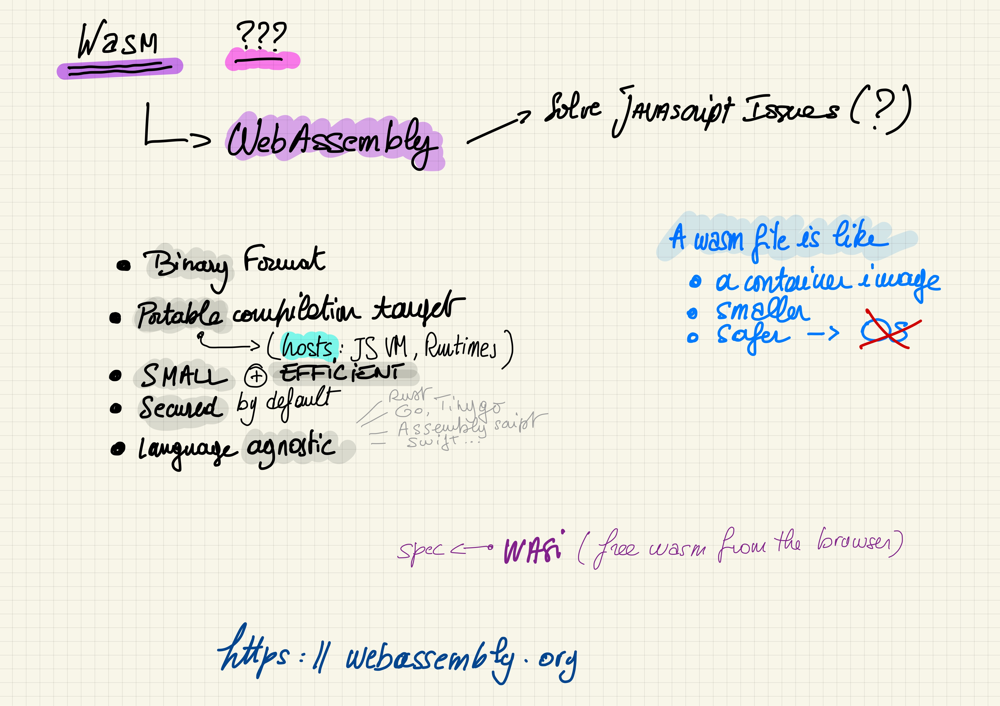

<style scoped>
  mark {
    background-color: #942EC1;
    color: #FFFFFF;
  }
</style>
# Petit cours de <mark>Wasm</mark> front/back par l'exemple

**SunnyTech 2022**

https://github.com/wasm-university/sunny-tech-2022

---
# Merci 😃

**à vous & à l'équipe Voxxed Luxembourg**

---


#### Philippe Charrière

- TAM @GitLab
- 🤖 Bots.Garden
- 🦊 @k33g
- 🐦 @k33g_org
- 🍊🦸Gitpod Hero
- GDG Cloud IOT Lyon
- RdV des speakers

---
# Déroulement

- 👋 Vous pouvez intervenir à tout moment
- 10% Théorie 90% Démos (en gros)
- 🚀 Des démos que vous pourrez refaire :
  - https://github.com/wasm-university
  - en utilisant <mark>Gitpod</mark>
  - ou en utilisant <mark>DevContainer</mark>

---
# Objectif(s)

- Université "découverte" par l’exemple
- Rien de complexe
- Repartir avec le bagage nécessaire 🧳

🖐️ Ne posez pas de questions compliquées 😛🙏
https://github.com/wasm-university/sunny-tech-2022/issues

---
# Une petite remarque ...

- Faire choisir le langage au démarrage 🤔
- En fait **Wasm** est polyglotte
- Donc la prez est polyglotte
  - ... Et j'ai galéré en **Rust** sur certains exemples compliqués 🥵

---

# WebAssembly ???

## WASM ???
### C'est parti ! 🚀

---
###### Wasm Quoi/Pourquoi ?



---
###### Histoire


---

## Wasm peut s’exécuter partout

JavaScript (navigateur)
JavaScript (Node.js)
GraalVM
Runtimes **WASI** (Wasmer, Wastime, Wasmedge, …): CLI & Libs
<!-- webassembly system interface -->

---

Wasm file ~= container image, **smaller**, safer, without an OS

---
###### Hosts


<!-- la portabilité de wasm dépend de l'hôte -->

---

# Wasm a "quelques" limitations

---

### 🖐️ Le module Wasm n’accède pas à l’OS

- Wasm c’est pour du compute (au départ)
- Pas d’accès aux fonctions systèmes de l’OS (hors host functions)
  - I/O
  - Sockets
- Pas d’accès à la mémoire hors allocation spécifique
<!-- vérifier cette partie -->

---

## <mark>Safe by default</mark>

### C'est une bonne limitation

---
### 📣 La Communication Wasm <=> Host  n’est pas triviale
> (trop bas niveau ?)

#### 4 types de données pour les paramètres:

  - 32 & 64 Bit Integer
  - 32 & 64 Bit Floating-Point Number

---
## String 😡

> Mais ...
> - Certains "hôtes" (et toolchains) ont déjà tout prévu
> - Certains frameworks aussi pour WASI *(WebAssembly System Interface)*

---


# 🛠 ToolChains

---
##### Toolchains par langage & hôte

<style scoped>
table {
    height: 80%;
    width: 100%;
    font-size: 20px;
    color: green;
}
th {
    color: blue;
}
mark {
  background-color: #EFD217;
  color: #000000;
}
</style>

Langage         | WASM (VM JS)                    | WASI                                     | Remarks
:---------------|:--------------------------------|:-----------------------------------------|:--------
C/C++           | EMScripten, LLVM (clang)        | LLVM, SDK C/C++ Wasmer                   |
<mark>Rust</mark>            | Wasm-pack + wasm-bindgen (glue) | rustup target add wasm32-wasi            | <mark>support navigateur</mark> 💖
<mark>Go</mark>              | Intégré à la toolchain standard | Non ou alors utiliser TinyGo             | <mark>support navigateur</mark> 💖
Assemblyscript  | Intégré                         | Intégré                                  | Ne cible que du WASM
Swift           | SwiftWasm                       | SwiftWasm                                |
Kotlin          | Kotlin native (expérimental)    |                                          |
C#              | Blazor (solution complète)      | <mark>dotnet add package Wasi.Sdk --prerelease</mark> |
Ruby            | Artichoke                       | En cours (portage CRuby Wasm32-WASI)     |
Python          | Expérimental                    |                                          |

<!-- regarder prez de Sébastien pour Kotlin -->
###### *Liste non exhaustive*

---

# Statut actuel de Wasm

https://blog.scottlogic.com/2022/06/20/state-of-wasm-2022.html

---


---
<style scoped>
mark {
  background-color: #EFD217;
  color: #000000;
}
mark-purple {
  background-color: #942EC1;
  color: #FFFFFF;
}

mark-orange {
  background-color: #F0B044;
  color: #000000;
}

mark-cyan {
  background-color: #44F0EF;
  color: #000000;
}

mark-grey {
  background-color: #E2E0D6;
  color: #000000;
}

mark-green {
  background-color: #71F09C;
  color: #000000;
}

</style>

#### (Très) Rapide résumé (issue du sondage)

- L'utilisation de <mark-purple>**WASM**</mark-purple> ++ fréquente
- Popularité de <mark-orange>**Rust**</mark-orange> en hausse
- De + en + de personnes veulent faire du <mark-purple>**WASM**</mark-purple> en <mark-cyan>**Go**</mark-cyan>
- <mark-green>**Wasmtime**</mark-green> est le runtime le plus utilisé (arm ? 🤔)
- Utilisation de <mark-purple>**WASM**</mark-purple> pour <mark-grey>**Serverless** & **plug-ins**</mark-grey> en hausse
- <mark>**JavaScript**</mark> est devenu un langage utilisable pour <mark-purple>**WASM**</mark-purple> 😮🤔

<!--
Rust usage and desireabillity has continued to climb
Python has seen a big climb in usage
JavaScript has become a viable WebAssembly language
It’s been a good year for Blazor, with a big climb in usage and desire
Wasmtime is the most widely used runtime
The use of WebAssembly for Serverless, Containerisation and as a plug-in host has climbed significantly
Survey respondents are using WebAssembly much more freq
-->

---
##### Near’s JS SDK based on QuickJS


---
##### JS to WebAssembly toolchain


---
##### Bringing JavaScript and TypeScript to Suborbital


---
# Liens relatifs à Wasm 💜 JavaScript

- [Thread Twitter de @BrendanEich](https://twitter.com/BrendanEich/status/1535304420426141696?ref_src=twsrc%5Etfw%7Ctwcamp%5Etweetembed%7Ctwterm%5E1535304420426141696%7Ctwgr%5E%7Ctwcon%5Es1_&ref_url=https%3A%2F%2Fblog.scottlogic.com%2F2022%2F06%2F20%2Fstate-of-wasm-2022.html)
- Javy (Shopify) : https://github.com/Shopify/javy
- Suborbital Blog Post : https://blog.suborbital.dev/bringing-javascript-and-typescript-to-suborbital

---


# Wasm & le Navigateur 🌍

---


### Avant de faire du Go
# 1er module Wasm en C

---

`main.c`
```c
#define WASM_EXPORT __attribute__((visibility("default")))

WASM_EXPORT
float power(float number, int pow) {
 float res = number;
   for (int i = 0;i < pow - 1; i++) {
     res = res * number;
   }
 return res;
}

WASM_EXPORT
char* greet()
{
    static char str[12] = "hello world!";
    return (char*)str;
}
```

---
#### Build

```bash
clang --target=wasm32 \
  --no-standard-libraries -Wl,--export-all -Wl, \
  --no-entry -o main.wasm main.c
```

---

`index.html`
```javascript
WebAssembly.instantiateStreaming(fetch("main.wasm"))
  .then(({ instance }) => {
    console.log("👋 main.wasm is loaded")

    const value = instance.exports.power(2, 2)

    console.log(`🤖 value: ${value}`)
    console.log(`👋 greet: ${instance.exports.greet()}`)

  })
  .catch(error => {
    console.log("😡 ouch", error)
  })
```

---


# Démo 🚀


<a href="https://github.com/wasm-university/sunny-tech-2022/tree/main/00-c-web" target="_blank">00-c-web</a>

---


# Wasm avec Go dans le navigateur

---

<style scoped>
  mark {
    background-color: #EFD217;
    color: #000000;
  }
</style>

# Go + JavaScript = 💖

```bash
cp "$(go env GOROOT)/misc/wasm/wasm_exec.js" .
```

```html
<script src="wasm_exec.js"></script>
```

 > Disclaimer, I 💛 <mark>**JavaScript**</mark>
---
<style scoped>
mark {
  background-color: #EFD217;
  color: #000000;
}
mark-purple {
  background-color: #942EC1;
  color: #FFFFFF;
}
mark-cyan {
  background-color: #44F0EF;
  color: #000000;
}
ul {
  font-size: 60%;
}
</style>

#### Fonction (<mark-purple>wasm</mark-purple>) en <mark-cyan>Go</mark-cyan>
##### Appelée en <mark>JavaScript</mark>

```go
func Hello(this js.Value, args []js.Value) interface{} {
  message := args[0].String() // get the parameters
  return "😃 Hello " + message
}
```

- 2 paramètres et une `interface en retour`
- le 1er `this` fait référence à l'objet global `window`
- le second est un slice de `[]js.Value` (ensemble des arguments passés lors de l'appel à partir de <mark>JavaScript</mark>)


---
<style scoped>
mark {
  background-color: #EFD217;
  color: #000000;
}
mark-purple {
  background-color: #942EC1;
  color: #FFFFFF;
}
ul {
  font-size: 60%;
}
</style>

#### Initialiser la fonction

```go
func main() {

  js.Global().Set("Hello", js.FuncOf(Hello))

  // make sure that the go program won't exit
  <-make(chan bool)
}
```
- La fonction `Hello` est rattaché à l'objet `Global` de <mark>JavaScript</mark>
- Utilisation d'une `channel` pour éviter "de sortir"

<!--
Et avec ça, on peut faire plein de choses ...
Comme en JavaScript 😉
-->

---
<style scoped>
mark {
  background-color: #EFD217;
  color: #000000;
}
mark-purple {
  background-color: #942EC1;
  color: #FFFFFF;
}
mark-cyan {
  background-color: #44F0EF;
  color: #000000;
}
ul {
  font-size: 60%;
}
</style>

#### Utilisation de la fonction <mark-cyan>Go</mark-cyan> en <mark>JavaScript</mark>

```javascript
const go = new Go() // Go Wasm runtime

WebAssembly.instantiateStreaming(fetch("main.wasm"), go.importObject)
  .then(resultObject => {
    // execute `main`
    go.run(resultObject.instance)
    // instance object contains
    // all the Exported WebAssembly functions
    let resultValue = Hello("Bob Morane")
    //😃 Hello "Bob Morane
  })
  .catch(error => {
    console.log("😡 ouch", error)
  })
```

<!--
Il est temps de voir quelques exemples
-->

---
### Mais aussi ...
---
<style scoped>
mark {
  background-color: #EFD217;
  color: #000000;
}
mark-purple {
  background-color: #942EC1;
  color: #FFFFFF;
}
mark-cyan {
  background-color: #44F0EF;
  color: #000000;
}
ul {
  font-size: 60%;
}
</style>

###### Appeler une fonction <mark>JavaScript</mark> à partir d'une Fonction (<mark-purple>wasm</mark-purple>) en <mark-cyan>Go</mark-cyan>

```go
import (
	"syscall/js"
)

func main() {

	message := "👋 Hello World from Go 🌍"

	// ! We got a reference to the DOM
	document := js.Global().Get("document")
	h2 := document.Call("createElement", "h2")
	h2.Set("innerHTML", message)
	document.Get("body").Call("appendChild", h2)

}
```

- `"syscall/js"` permet à WebAssembly d'accéder à l'hôte (navigateur)
- la méthode `Call` permet d'appeler des fonctions <mark>JavaScript</mark> (std+udf)

---
<style scoped>
mark-cyan {
  background-color: #44F0EF;
  color: #FFFFFF;
}
</style>


# Démos 🚀

<a href="https://github.com/wasm-university/sunny-tech-2022/tree/main/01-go-hello" target="_blank">01-go-hello</a>
<a href="https://github.com/wasm-university/sunny-tech-2022/tree/main/02-wasm-go-boids" target="_blank">02-wasm-go-boids (<mark-cyan>with TinyGo</mark-cyan>)</a>

---

<style scoped>
  mark {
    background-color: #EFD217;
    color: #000000;
  }
  mark-green {
    background-color: #12984E;
    color: #FFFFFF;
  }
  mark-orange {
    background-color: #F0B044;
    color: #000000;
  }
</style>


# Wasm avec <mark-orange>Rust</mark-orange> dans le navigateur et aussi <mark-green>Node.js</mark-green>
##### 2 VMs <mark>JavaScript</mark>

## 🦀 + 🕸️ = 💖

https://rustwasm.github.io/

---

# Facile ?
## avec Wasm Bindgen, OUI ‼️ 😍

https://github.com/rustwasm/wasm-bindgen
> Facilitating high-level interactions between Wasm modules and JavaScript

---

#### Créer un projet "Rust Wasm"

###### <mark>Créer un projet de type "library"</mark>

```bash
cargo new --lib hello
```

###### <mark>Mise à jour de `Cargo.toml`</mark>

```toml
[lib]
name = "hello"
path = "src/lib.rs"
crate-type =["cdylib"]

[dependencies]
wasm-bindgen = "0.2.50"
```

---

###### <mark>Modifier `main.rs`<mark>

```rust
use wasm_bindgen::prelude::*;

#[wasm_bindgen]
pub fn hello(s: String) -> String {
  let r = String::from("👋 hello ");

  return r + &s;
}
```

---

###### <mark>Compiler pour le navigateur<mark>

```bash
cd hello
wasm-pack build --release --target web
```
> 🖐️ `--target web`

###### <mark>Compiler pour Node.js<mark>

```bash
wasm-pack build --release --target nodejs
```
> 🖐️ `--target nodejs`

---

######  <mark>Utiliser dans le navigateur<mark>

```html
<script type="module">
  import init, { hello } from './hello/pkg/hello.js'

  async function run() {
    await init()
    console.log(hello("Bob Morane"))
  }
  run();
</script>
```

######  <mark>Utiliser avec Node.js<mark>


```javascript
const wasm = require("./hello/pkg/hello")

console.log(wasm.hello("Bob Morane")
```

---


# Démos 🚀


<a href="https://github.com/wasm-university/sunny-tech-2022/tree/main/03-nodejs-rust-function" target="_blank">03-nodejs-rust-function</a>

---
