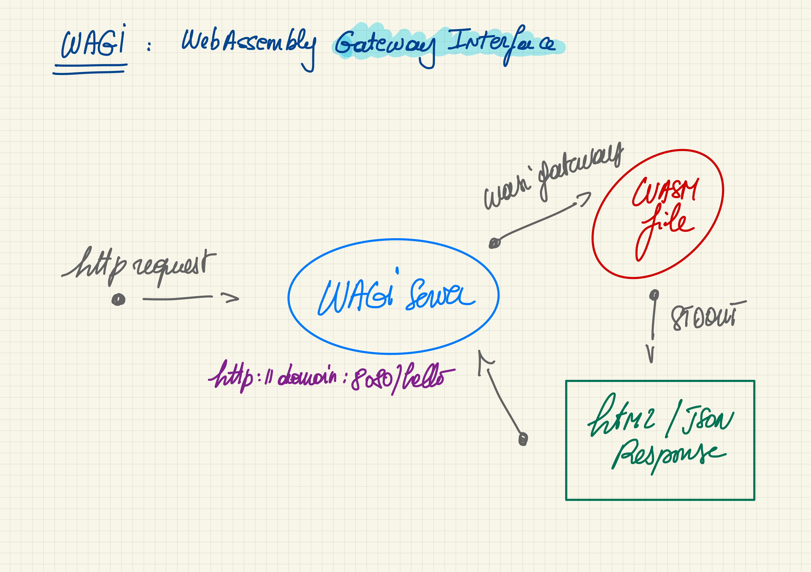
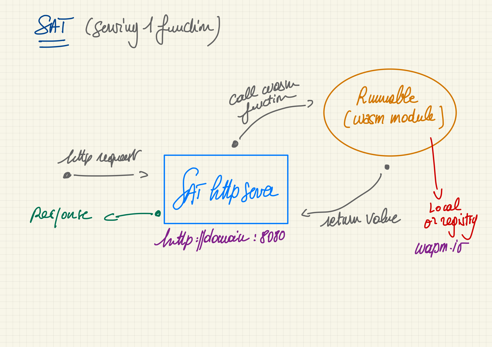

<style scoped>
  mark {
    background-color: #17EFE7;
    color: #000000;
  }
</style>

# Libérez, délivrez Wasm
## ... du navigateur (de la VM JS)
# <mark>WASI</mark>
https://wasi.dev/

---

<style scoped>
  mark {
    background-color: #17EFE7;
    color: #000000;
  }
</style>

### WASI: WebAssembly System Interface
#### WebAssembly comme <mark>"Portable Runtime"</mark>

WASI == Les fondations pour "sortir" Wasm du navigateur

#### Sous-groupe de spécifications WebAssembly

---

<style scoped>
  mark {
    background-color: #17EFE7;
    color: #000000;
  }
</style>

### Comme la JVM (conceptuellement)
#### mais en mieux ?

- Sécurisé
- Polyglotte
- Rapide
- <mark>Léger</mark>

---

<style scoped>
  mark {
    background-color: #F7C00E;
    color: #000000;
  }
</style>

### Un module WebAssembly <mark>ne peut pas</mark>

- Accéder au système d’exploitation
- Accéder à la mémoire que le host ne lui a pas donnée
- Faire des requêtes sur le réseau
- Lire ou écrire dans des fichiers


---
<style scoped>
  mark {
    background-color: #17EFE7;
    color: #000000;
  }
</style>

**WASI est une spécification pour pouvoir fournir un accès <mark>sécurisé et isolé</mark> au système sur lequel s’exécute <mark>l’hôte du module Wasm</mark>.**

---

###### Host Runtime


---

## Les projets de runtimes WASI

- Pour exécuter du code Wasm à partir d’une CLI
- Pour exécuter du code Wasm à partir d’un autre langage (Rust, Go, C/C++) >> SDK

---

## Les 3 les plus reconnus du moment :

- **Wasmer**: https://wasmer.io/
- **Wasmtime**: https://wasmtime.dev/
- **WasmEdge**: https://wasmedge.org/
---

##### SDK WASI / Langage <mark>(<> CLI)</mark>

<style scoped>
  mark {
    background-color: #17EFE7;
    color: #000000;
  }
  table {
      height: 80%;
      width: 100%;
      font-size: 20px;
      color: green;
  }
  th {
      color: blue;
  }
</style>

Langage             | WASMER                   | WASMEDGE (+arm)           | WASMTIME (+arm)
:-------------------|:-------------------------|:--------------------------|:--------
  <mark>Rust</mark> |  x                       |  x                        |  x
  <mark>Go</mark>   |  x (<mark>TinyGo</mark>) |  x  (<mark>TinyGo</mark>) |  x (<mark>TinyGo</mark>)
  <mark>C</mark>    |  x                       |  x                        |  x
  C++               |  x                       |                           |
  Python            |  x                       |  x                        |  x
  Swift             |  x                       |  x                        |  ?
  Grain             |                          |  x                        |  ?
  .Net              |  x (C#)                  |                           |  x
  NodeJS            |  x                       |  x                        |
  Bash              |                          |                           |  x
  Java              |  x                       |                           |  x (outside Bytecode Alliance)
  Perl              |                          |                           |  x (outside Bytecode Alliance)
  Zig               |  x (not published)       |                           |  x (outside Bytecode Alliance)
  Ruby              |                          |                           |  x (outside Bytecode Alliance)
> - Wasmer supporte d'autres langages
---
<style scoped>
  mark {
    background-color: #17EFE7;
    color: #000000;
  }
</style>

# Bytecode Alliance

https://bytecodealliance.org/

- WASM / WASI => les spécifications par le W3C,
- La Bytecode Alliance s’occupe de l’implémentation

Avec Amazon, ARM, <mark>Cosmonic</mark>, Fastly, Google, Intel, <mark>Fermyon</mark>, <mark>Suborbital</mark>, Microsoft, Mozilla, Shopify, Siemens ...

---


# Démos 🚀
## Les CLI des runtimes WASI

<a href="https://github.com/wasm-university/training/tree/main/13-go-wasi-cli-app" target="_blank">13-go-wasi-cli-app</a>
<a href="https://github.com/wasm-university/training/tree/main/14-rust-wasi-cli-function" target="_blank">14-rust-wasi-cli-function</a>


---

## Utiliser un SDK (WasmEdge)

#### Faites votre propre "CLI Wasm" 🤓

#### Appeler des fonctions Wasm à partir de Go 🚀

La documentation de WasmEdge est 💖
https://wasmedge.org/book/en/embed/go.html
https://github.com/second-state/WasmEdge-go-examples

---


# Démos 🚀
## Utilisation du SDK WasmEdge

<a href="https://github.com/wasm-university/training/tree/main/15-go-wasmedge-cli" target="_blank">15-go-wasmedge-cli</a>
<a href="https://github.com/wasm-university/training/tree/main/16-go-wasmedge-function" target="_blank">16-go-wasmedge-function</a>

<!-- montrer le code -->

---

## Utiliser le WASI SDK pour .NET Core

- Le **Wasi.Sdk** est expérimental
- Il permet de compiler des projets .NET Core en Wasm
- Il est aussi possible de faire des apps ASP.NET Core

---
<style scoped>
  mark {
    background-color: #17EFE7;
    color: #000000;
  }
</style>

### Application console

```bash
dotnet new console -o hello
cd hello
dotnet add package Wasi.Sdk --prerelease
dotnet build
```

<mark>16M bin/Debug/net7.0/hello.wasm</mark>

```bash
wasmtime bin/Debug/net7.0/hello.wasm
```
---
<style scoped>
  mark {
    background-color: #17EFE7;
    color: #000000;
  }
</style>

### Application ASP.Net

```bash
dotnet new web -o hello
cd hello
dotnet add package Wasi.Sdk --prerelease
dotnet add package Wasi.AspNetCore.Server.Native --prerelease
dotnet build
```

<mark>31M bin/Debug/net7.0/hello.wasm</mark>

```bash
wasmtime bin/Debug/net7.0/hello.wasm --tcplisten localhost:8080
```

---


# Démos 🚀
## Utilisation du SDK .Net

<a href="https://github.com/wasm-university/training/tree/main/17-dotnet-wasi-cli-app" target="_blank">17-dotnet-wasi-cli-app</a>
<a href="https://github.com/wasm-university/training/tree/main/18-dotnet-wasi-asp" target="_blank">18-dotnet-wasi-asp</a>

<!-- montrer le code -->
---
<style scoped>
  mark {
    background-color: #17EFE7;
    color: #000000;
  }
</style>
###  Ok, plutôt facile 😛
### Mais comment je fais si je veux passer une <mark>String</mark> à ma fonction ?


---


# Combattre les limitations
# De WASI (et Wasm)


---
<style scoped>
  mark {
    background-color: #17EFE7;
    color: #000000;
  }
</style>
# Des limitations

- **Système de type trop simple**
  - <mark>Seulement 4 types numériques</mark> :
    - Integers (32 & 64 bit)
    - Floats (32 & 64 bit)

- **Mode d’exécution fermé du module Wasm**
  - <mark>Pas d’accès à "l’extérieur"</mark> :
    - Pas d’appel http
    - Pas d’accès fichier
    - ...

---
<style scoped>
  mark {
    background-color: #17EFE7;
    color: #000000;
  }
</style>
## Mais : à venir

- **SIMD** : parallel computing
- **Threads** comme les Web Workers, gérés par le host
- **Exception Handling** : events + handler
- **ECMAScript Module Integration** : `import {foo} from "./myModule.wasm"`
- **Garbage Collection**
- <mark><b>Interface Types</b></mark> : décrire des types de plus haut niveau, éviter les frictions

https://hacks.mozilla.org/2019/08/webassembly-interface-types/

---


# Comment contourner ces limitations
### "the hard way"

---


# Passage de Strings à une fonction
### Avec WasmEdge

Pass complex parameters to Wasm functions:
https://wasmedge.org/book/en/embed/go/memory.html


---

# Inspiré d'un exemple
https://github.com/second-state/WasmEdge-go-examples/blob/master/go_MemoryGreet/greet_memory.go

---


<style scoped>
ul {
   font-size: 70%;
}
</style>

> 👋 fonctionnement

- Charger le module Wasm (par l'hôte)
- Copier la valeur de la string en mémoire
- Appeler la fonction Wasm en lui passant
  - le nom de la fonction
  - un pointeur sur la mémoire
- Côté fonction
  - Décoder le pointeur `Int32Ptr` en String
  - Exécuter la fonction (construire une nouvelle String)
  - Transformer la nouvelle String en pointeur `BytePtr` pour la retourner à l'hôte
- Côté hôte
  - Transformer le résultat en String
---


# Démo 🚀
## Passer une String à une fonction

<a href="https://github.com/wasm-university/training/tree/main/19-go-wasmedge-strings" target="_blank">19-go-wasmedge-strings</a>

<!-- montrer le code -->

---


# Host Functions
### Avec WasmEdge
#### 🖐️ on ne peut pas faire un fetch à partir d'un module wasm

https://wasmedge.org/book/en/extend/plugin/hostfunction.html#host-functions

---

# Inspiré d'un exemple

https://github.com/second-state/WasmEdge-go-examples/blob/master/go_HostFunc/hostfunc.go

Ça pique un peu ... 😢


---

###### Principe


---


<style scoped>
ul {
   font-size: 100%;
}
</style>

### Comment ça marche

- Utiliser les fonctions hôtes d’un programme Go à partir d’un module wasm Rust

- Côté host :
  - Ecrire 2 hosts functions `fetch` & `writeMem`
  - Définir 2 nouveaux `FunctionType`
  - Les ajouter au module wasm
  - Lancer le tout 🚀

---


<style scoped>
ul {
   font-size: 100%;
}
</style>

### Comment ça marche

- Côté module wasm :
  - Référencer les fonctions
  ```rust
  extern "C" {
    fn fetch(url_pointer: *const u8, url_length: i32) -> i32;
    fn write_mem(pointer: *const u8);
  }
  ```
  - Et les utiliser

---


# Démo 🚀
## Host functions

<a href="https://github.com/wasm-university/training/tree/main/20-go-rust-host-function" target="_blank">20-go-rust-host-function</a>

<!-- montrer le code -->

---


# Comment contourner ces limitations
### "the soft 🤗 way"

---

# Sat
## Suborbital
### un SDK (?) au dessus des SDK


https://suborbital.dev/
<!--
https://github.com/suborbital/sat/issues/122
-->
---


---

### Runnable(s)
<!-- polyglotes -->
`subo create runnable hello`
```rust
use suborbital::runnable::*;

struct Hello{}

impl Runnable for Hello {
  fn run(&self, input: Vec<u8>) -> Result<Vec<u8>, RunErr> {
    let in_string = String::from_utf8(input).unwrap();

    Ok(String::from(format!("hello {}", in_string)).as_bytes().to_vec())
  }
}
```

---

### Runnable(s) polyglottes
`subo create runnable hey --lang tinygo`
```go
package main

import (
	"github.com/suborbital/reactr/api/tinygo/runnable"
)

type Hey struct{}

func (h Hey) Run(input []byte) ([]byte, error) {
	return []byte("Hello, " + string(input)), nil
}
```

---

### Runnable(s) polyglottes
Go, Rust, mais aussi:
- AssemblyScript
- Swift (lent)
- Grain 😍
- JavaScript https://github.com/Shopify/javy
- TypeScript https://github.com/Shopify/javy

https://blog.suborbital.dev/bringing-javascript-and-typescript-to-suborbital

<!--
Introduction: Run your JavaScript on WebAssembly. Javy takes your JavaScript code, and executes it in a WebAssembly embedded JavaScript runtime.
-->
---

## Subo (toolchain)

```bash
subo create runnable hola --lang assemblyscript
cd hola
subo build .
```

---
<style scoped>
  mark {
    background-color: #17EFE7;
    color: #000000;
  }
</style>

### Sat (sdk mais pas que)
Embarquer du <mark>wasm</mark> dans vos applications <mark>Go</mark>

```go
wasmModuleConfig, _ := sat.ConfigFromRunnableArg("hello.wasm")
satFunction, _ := sat.New(wasmModuleConfig, nil)

result, err := satFunction.Exec([]byte("Bob"))
if err != nil {
  log.Fatal(err)
}

fmt.Println("🎉 " + string(result.Output))
```

---
<style scoped>
  mark {
    background-color: #F7C00E;
    color: #000000;
  }
</style>


# Démo(s) 🚀
### Une CLI "facile" avec Sat
#### <mark>Strings & Host Functions</mark>

<a href="https://github.com/wasm-university/training/tree/main/21-go-sat" target="_blank">21-go-sat</a>

---
<style scoped>
  mark {
    background-color: #FFFFFF;
    color: #000000;
  }
</style>

# Perspectives (Wasi & SDK)

- Write once, run anywhere (encore un peu de travail)
  - Runtimes multi-plateformes
- Applications (CLI ou autre) avec plugins wasm
- "Lanceurs/Serveurs" de modules wasm
  - <mark>**Sécurité** 🖐️</mark>
  - Activation/Ajout de fonctionnalités
  - Bots, Hooks, FaaS, UDF, ...


---
<style scoped>
  mark {
    color: #44F099;
  }
</style>


# MicroServices, FaaS, ...
### <mark>Avec WebAssembly</mark>

<!--
- Utiliser d'autres langages (ex Grain)
- Parler des tests de charges
-->
---

# Wagi


https://deislabs.io/

- **WAGI**: WebAssembly Gateway Interface https://github.com/deislabs/wagi
- **Hippo**, the WebAssembly PaaS https://github.com/deislabs/hippo

---




---

```go
package main

import "fmt"

func main() {
	fmt.Println("content-type: text/plain;utf-8")
	fmt.Println("")
	fmt.Println("👋 Hello World 🌍")
}
```
> GET
```bash
curl http://localhost:3000/hello
```
---

# Spin


https://www.fermyon.com/


https://spin.fermyon.dev/


---

### Spin
##### L'évolution de Wagi | Rust & Go (mais pas que)

- Micro Service https://www.wasm.builders/fermyon/a-one-line-microservice-with-spin-33ke
- Bartholomew MicroCMS https://github.com/fermyon/bartholomew
- Kitchensink https://github.com/fermyon/spin-kitchensink

---

##### Spin service en Go (TinyGo)

```go
package main

import (
 "fmt"
 "net/http"

 spinhttp "github.com/fermyon/spin/sdk/go/http"
)

func init() {
 spinhttp.Handle(func(w http.ResponseWriter, r *http.Request) {
  w.Header().Set("Content-Type", "text/plain")
  fmt.Fprintln(w, "Hello Fermyon!")
 })
}

func main() {}
```

---

# Sat 😍


---

# Sat
Pas uniquement une librairie, mais aussi un serveur http
- À base de "**Runnables**"
- Multi langages
  - Rust, Go, AssemblyScript, Grain, Swift, JavaScript, TypesSript)
- Facile à utiliser

---




---

##### Sat [Swift]
`subo create runnable yo --lang swift`

```swift
import Suborbital

class Yo: Suborbital.Runnable {
    func run(input: String) -> String {
        return "hello " + input
    }
}

Suborbital.Set(runnable: Yo())
```

---

### Build, Run
#### Serverless function

`subo build yo`
`SAT_HTTP_PORT=8080 sat ./yo/yo.wasm`
`curl -d "Bob Morane" http://localhost:8080`

https://www.wasm.builders/suborbital/a-simple-data-hashing-serverless-function-using-sat-3fn0

---

#### Wapm.io (Wasmer)
Wasm registry

`SAT_HTTP_PORT=8080 sat https://registry-cdn.wapm.io/contents/k33g/forty-two/1.0.0/forty-two.wasm`

https://www.wasm.builders/k33g_org/publish-your-runnables-on-wapmio-49k0

---

#### Fly.io
Caas | Déploiement ultra simple

https://www.wasm.builders/k33g_org/deploy-a-sat-serverless-function-with-to-flyio-35df

---

# Wasm Cloud


https://cosmonic.com/

---

# Wasm Cloud
https://cosmonic.com/ | https://wasmcloud.com/

Une plateforme + un SDK + un Runtime
- Nats (communications) https://docs.nats.io/
- Système à base d'acteurs

---
<style scoped>
code {
   font-size: 60%;
}
</style>

##### Wasm Cloud [Rust]

`wash new actor hello --template-name hello`

```rust
/// Implementation of HttpServer trait methods
#[async_trait]
impl HttpServer for HelloActor {

    async fn handle_request(&self, _ctx: &Context, req: &HttpRequest,) -> std::result::Result<HttpResponse, RpcError> {
        let text = ...;

        Ok(HttpResponse {
            body: format!("Hello {}", text).as_bytes().to_vec(),
            ..Default::default()
        })
    }
}
```

---

<style scoped>
code {
   font-size: 60%;
}
</style>

##### Wasm Cloud [TinyGo]

`wash new actor hello --template-name echo-tinygo`

```go
func main() {
	me := Hey{}
	actor.RegisterHandlers(httpserver.HttpServerHandler(&me))
}

type Hey struct{}

func (e *Hey) HandleRequest(ctx *actor.Context, req httpserver.HttpRequest) (*httpserver.HttpResponse, error) {
	r := httpserver.HttpResponse{
		StatusCode: 200,
		Header:     make(httpserver.HeaderMap, 0),
		Body:       []byte("hello"),
	}
	return &r, nil
}
```
---

<style scoped>
  mark {
    background-color: #F7C00E;
    color: #000000;
  }
</style>


# Démo(s) 🚀

<a href="https://github.com/wasm-university/training/tree/main/22-wagi" target="_blank">22-wagi</a>
<a href="https://github.com/wasm-university/training/tree/main/23-spin" target="_blank">23-spin</a>
<a href="https://github.com/wasm-university/training/tree/main/24-sat" target="_blank">24-sat</a>

---

<style scoped>
  mark {
    color: #44F099;
  }
</style>


# Et après ?
### <mark>Le futur de WebAssembly</mark> 👀


---
<style scoped>
ul {
   font-size: 70%;
}
</style>
##### À suivre https://github.com/WebAssembly
*Juin 2022 :*
- https://github.com/WebAssembly/component-model
  - amélioration intégration host
  - activité (GitHub Insights) en début d'année et un peu récemment
- https://github.com/WebAssembly/interface-types
  - reporté dans component-model
- https://github.com/WebAssembly/exception-handling
  - grosse activité en début d'année
- https://github.com/WebAssembly/debugging
  - 💀 😢
- https://github.com/WebAssembly/wasi-filesystem
  - un peu d'activité récemment


---
<style scoped>
  mark {
    color: #44F099;
  }
</style>


# Merci 😃

## <mark>Questions ?<mark>
---
