<style scoped>
  mark {
    background-color: #942EC1;
    color: #FFFFFF;
  }
</style>
# Petit cours de <mark>Wasm</mark> front/back par l'exemple

**Voxxed Luxembourg 2022**

https://github.com/wasm-university/training

---
# Merci 😃

**à vous & à l'équipe Voxxed Luxembourg**

---


#### Philippe Charrière

- TAM @GitLab
- 🤖 Bots.Garden
- 🦊 @k33g
- 🐦 @k33g_org
- 🍊🦸Gitpod Hero
- GDG Cloud IOT Lyon
- RdV des speakers

---

# Déroulement

- 👋 Vous pouvez intervenir à tout moment
- 10% Théorie 90% Démos (en gros)
- 🚀 Des démos que vous pourrez refaire :
  - https://github.com/wasm-university
  - en utilisant <mark>Gitpod</mark>
  - ou en utilisant <mark>DevContainer</mark>

---

# Objectif(s)

- Université "découverte" par l’exemple
- Rien de complexe
- Repartir avec le bagage nécessaire 🧳

🖐️ Ne posez pas de questions compliquées 😛🙏
https://github.com/wasm-university/training/issues

---

# WebAssembly ???

## WASM ???
### C'est parti ! 🚀

---

###### Wasm Quoi/Pourquoi ?

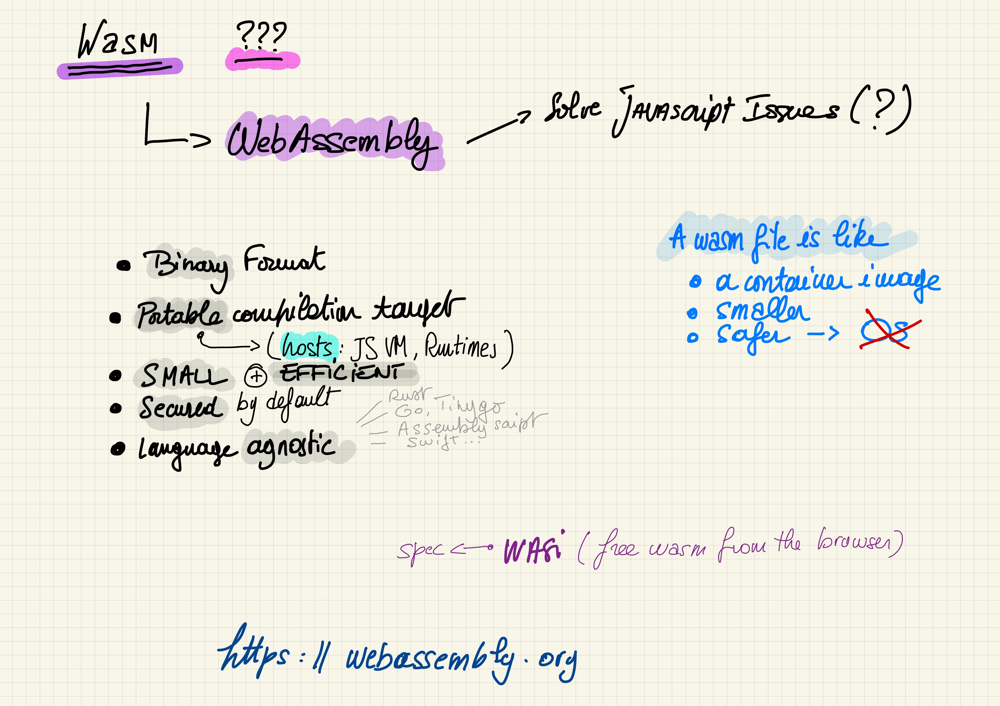


---

###### Histoire

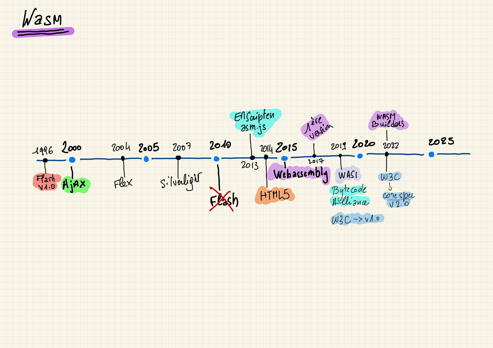

---

## Wasm peut s’exécuter partout

JavaScript (navigateur)
JavaScript (Node.js)
GraalVM
Runtimes **WASI** (Wasmer, Wastime, Wasmedge, …): CLI & Libs
<!-- webassembly system interface -->
---

Wasm file ~= container image, **smaller**, safer, without an OS

---

###### Hosts

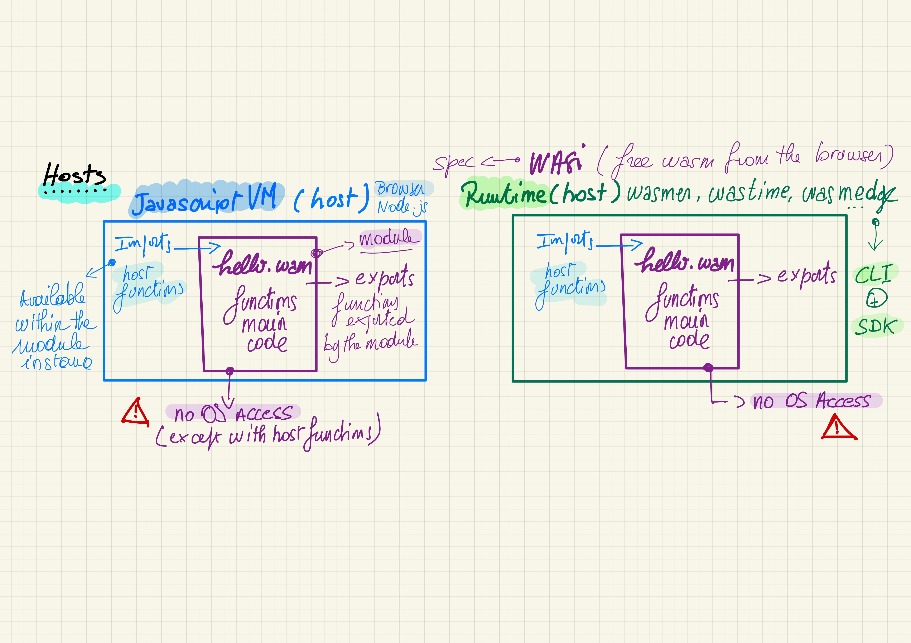


<!-- la portabilité de wasm dépend de l'hôte -->

---

# Wasm a "quelques" limitations

---

### 🖐️ Le module Wasm n’accède pas à l’OS

- Wasm c’est pour du compute (au départ)
- Pas d’accès aux fonctions systèmes de l’OS (hors host functions)
  - I/O
  - Sockets
- Pas d’accès à la mémoire hors allocation spécifique
<!-- vérifier cette partie -->

---

## C'est une bonne limitation
### <mark>Safe by default</mark>

---

### 📣 La Communication Wasm <=> Host  n’est pas triviale
> (trop bas niveau ?)

#### 4 types de données pour les paramètres:

  - 32 & 64 Bit Integer
  - 32 & 64 Bit Floating-Point Number

---

## String 😡

---

> Certains "hôtes" (et toolchains) ont déjà tout prévu (certains frameworks aussi pour WASI)

---


# 🛠 ToolChains

---

##### Toolchains par langage & hôte

<style scoped>
table {
    height: 80%;
    width: 100%;
    font-size: 20px;
    color: green;
}
th {
    color: blue;
}
</style>

Langage         | WASM (VM JS)                    | WASI                                     | Remarks
:---------------|:--------------------------------|:-----------------------------------------|:--------
C/C++           | EMScripten, LLVM (clang)        | LLVM, SDK C/C++ Wasmer                   |
Rust            | Wasm-pack + wasm-bindgen (glue) | rustup target add wasm32-wasi            | support navigateur 💖
Go              | Intégré à la toolchain standard | Non ou alors utiliser TinyGo             | support navigateur 💖
Assemblyscript  | Intégré                         | Intégré                                  | Ne cible que du WASM
Swift           | SwiftWasm                       | SwiftWasm                                |
Kotlin          | Kotlin native (expérimental)    |                                          |
C#              | Blazor (solution complète)      | dotnet add package Wasi.Sdk --prerelease |
Ruby            | Artichoke                       | En cours (portage CRuby Wasm32-WASI)     |
Python          | Expérimental                    |                                          |

<!-- regarder prez de Sébastien pour Kotlin -->
###### *Liste non exhaustive*
---


# Wasm & le Navigateur

---

- 1er contact: un peu de C
- Go
- Rust

---


### Avant de faire du Go
# 1er module Wasm en C

---

`main.c`
```c
#define WASM_EXPORT __attribute__((visibility("default")))

WASM_EXPORT
float power(float number, int pow) {
 float res = number;
   for (int i = 0;i < pow - 1; i++) {
     res = res * number;
   }
 return res;
}

WASM_EXPORT
char* greet()
{
    static char str[12] = "hello world!";
    return (char*)str;
}
```

---

```bash
clang --target=wasm32 \
  --no-standard-libraries -Wl,--export-all -Wl, \
  --no-entry -o main.wasm main.c
```

---

`index.html`
```javascript
WebAssembly.instantiateStreaming(fetch("main.wasm"))
  .then(({ instance }) => {
    console.log("👋 main.wasm is loaded")

    const value = instance.exports.power(2, 2)

    console.log(`🤖 value: ${value}`)
    console.log(`👋 greet: ${instance.exports.greet()}`)

  })
  .catch(error => {
    console.log("😡 ouch", error)
  })
```

---


# Démo 🚀


<a href="https://github.com/wasm-university/training/tree/main/00-c-web" target="_blank">00-c-web</a>

---


# Wasm avec Go dans le navigateur

---

###### Mode de fonctionnement des démos Web (avec Go)

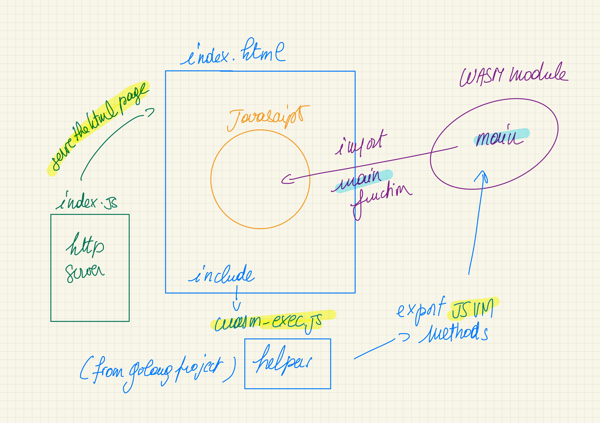


---

<style scoped>
  mark {
    background-color: #EFD217;
    color: #000000;
  }
</style>

# Go + JavaScript = 💖

```bash
cp "$(go env GOROOT)/misc/wasm/wasm_exec.js" .
```

```html
<script src="wasm_exec.js"></script>
```

 > Disclaimer, I 💛 <mark>**JavaScript**</mark>
---

## Fonctions en Go:
`[]js.Value` <mark>&</mark> `interface{}`

```go
func Hello(this js.Value, args []js.Value) interface{} {
  message := args[0].String() // get the parameters
  return "😃 Hello " + message
}
```

```go
js.Global().Set("Hello", js.FuncOf(Hello))
```

<!--
Et avec ça, on peut faire plein de choses ...
Comme en JavaScript 😉
-->

---

## Utilisation de la fonction Go

```javascript
const go = new Go() // Go Wasm runtime

WebAssembly.instantiateStreaming(fetch("main.wasm"), go.importObject)
  .then(result => { // Get the importObject from the go instance.
    // execute `main`
    go.run(result.instance)
    // instance object contains
    // all the Exported WebAssembly functions
    Hello("Bob Morane")
    //😃 Hello "Bob Morane
  })
  .catch(error => {
    console.log("😡 ouch", error)
  })
```

<!--
Il est temps de voir quelques exemples
-->

---


# Démos 🚀

<a href="https://github.com/wasm-university/training/tree/main/01-go-hello" target="_blank">01-go-hello</a>
<a href="https://github.com/wasm-university/training/tree/main/02-go-dom" target="_blank">02-go-dom</a>
<a href="https://github.com/wasm-university/training/tree/main/03-go-call-go-function" target="_blank">03-go-call-go-function</a>
<a href="https://github.com/wasm-university/training/tree/main/04-go-return-json" target="_blank">04-go-return-json</a>
<a href="https://github.com/wasm-university/training/tree/main/05-go-json-as-parameter" target="_blank">05-go-json-as-parameter</a>
<a href="https://github.com/wasm-university/training/tree/main/06-go-call-a-js-function" target="_blank">06-go-call-a-js-function</a>
<a href="https://github.com/wasm-university/training/tree/main/07-go-call-js-promise" target="_blank">07-go-call-js-promise</a>

---


# Wasm avec Rust dans le navigateur

## 🦀 + 🕸️ = 💖

https://rustwasm.github.io/

---

# Facile ?

---

# Avec Wasm Bindgen, OUI ‼️

https://github.com/rustwasm/wasm-bindgen
> Facilitating high-level interactions between Wasm modules and JavaScript

---

#### Créer un projet "Rust Wasm"

<mark>Créer un projet de type "library"</mark>

```bash
cargo new --lib hello
```

<mark>Mise à jour de `Cargo.toml`</mark>

```toml
[lib]
name = "hello"
path = "src/lib.rs"
crate-type =["cdylib"]

[dependencies]
wasm-bindgen = "0.2.50"
```

---

<mark>Modifier `main.rs`<mark>

```rust
use wasm_bindgen::prelude::*;

#[wasm_bindgen]
pub fn hello(s: String) -> String {
  let r = String::from("👋 hello ");

  return r + &s;
}
```

<mark>Compiler<mark>

```bash
cd hello
wasm-pack build --release --target web
```
> 🖐️ `--target web`
---

<mark>Utiliser<mark>

```html
<script type="module">
  import init, { hello } from './hello/pkg/hello.js'

  async function run() {
    await init()
    console.log(hello("Bob"))
    console.log(hello("Jane"))
    console.log(hello("John"))
  }
  run();
</script>
```

---


# Démos 🚀

<a href="https://github.com/wasm-university/training/tree/main/08-rust-hello" target="_blank">08-rust-hello</a>
<a href="https://github.com/wasm-university/training/tree/main/09-rust-call-with-json" target="_blank">09-rust-call-with-json</a>
<a href="https://github.com/wasm-university/training/tree/main/10-rust-dom" target="_blank">10-rust-dom</a>


---
<style scoped>
  mark {
    background-color: #EFD217;
    color: #000000;
  }
  mark-green {
    background-color: #12984E;
    color: #000000;
  }
</style>


# Wasm & <mark-green>NodeJS</mark-green>

## VM <mark>JavaScript</mark>

---


# C'est comme pour le navigateur ... 😍

🖐️ Attention, pour Rust :

```bash
wasm-pack build --release --target nodejs
```

---


# Démos 🚀

<a href="https://github.com/wasm-university/training/tree/main/11-nodejs-go-function" target="_blank">11-nodejs-go-function</a>
<a href="https://github.com/wasm-university/training/tree/main/12-nodejs-rust-function" target="_blank">12-nodejs-rust-function</a>

---


# Cas d'utilisation
### (Wasm dans le navigateur)
---

# Quelques applications

- Jeux Vidéos
- "Vraies" applications
- Traitement d’image en local (dans le navigateur), OCR
- Cartographie
- Machine Learning
- Chiffrement dans le navigateur
- ...

---

### https://web.autocad.com

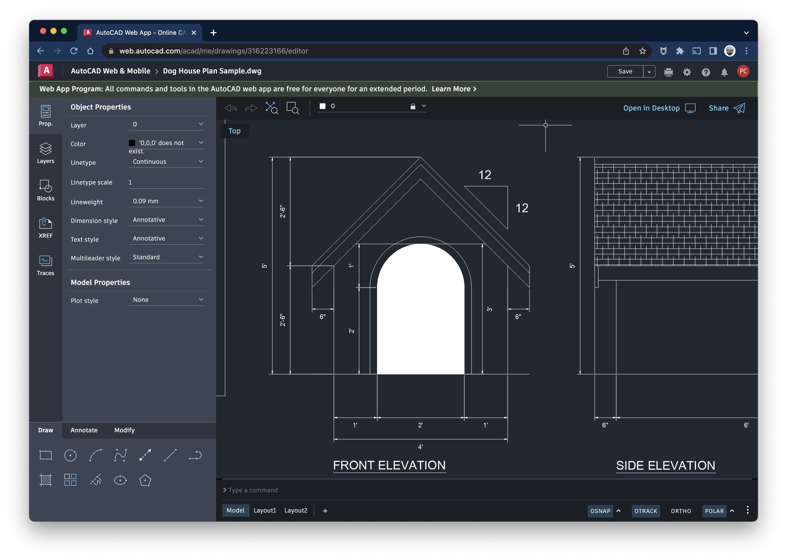

---

#### https://beta.unity3d.com/jonas/AngryBots/


<!--
https://blog.unity.com/technology/webassembly-is-here
-->
---

#### https://github.com/naptha/tesseract.js

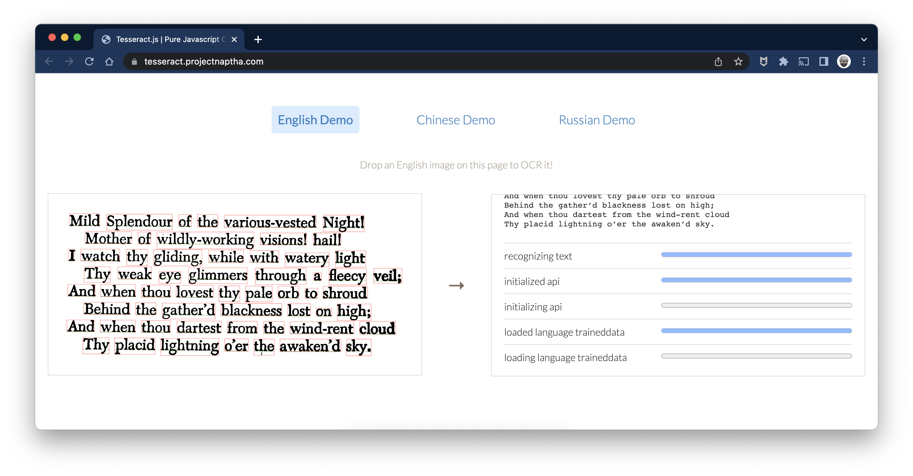

<!-- OCR ordonances Doctolib -->
---

# Webcontainers

https://blog.stackblitz.com/posts/introducing-webcontainers/
https://github.com/stackblitz/webcontainer-core
https://stackblitz.com/edit/node-merzas?file=package.json,index.js

---

# Plus besoin de l’AppStore ? 😬

<!-- l'avenir nous le dira -->

---


<style scoped>
  mark {
    background-color: #17EFE7;
    color: #000000;
  }
</style>

# Libérez, délivrez Wasm
## ... du navigateur (de la VM JS)
# <mark>WASI</mark>
https://wasi.dev/

---

<style scoped>
  mark {
    background-color: #17EFE7;
    color: #000000;
  }
</style>

### WASI: WebAssembly System Interface
#### WebAssembly comme <mark>"Portable Runtime"</mark>

WASI == Les fondations pour "sortir" Wasm du navigateur

#### Sous-groupe de spécifications WebAssembly

---

<style scoped>
  mark {
    background-color: #17EFE7;
    color: #000000;
  }
</style>

### Comme la JVM (conceptuellement)
#### mais en mieux ?

- Sécurisé
- Polyglotte
- Rapide
- <mark>Léger</mark>

---

<style scoped>
  mark {
    background-color: #F7C00E;
    color: #000000;
  }
</style>

### Un module WebAssembly <mark>ne peut pas</mark>

- Accéder au système d’exploitation
- Accéder à la mémoire que le host ne lui a pas donnée
- Faire des requêtes sur le réseau
- Lire ou écrire dans des fichiers


---
<style scoped>
  mark {
    background-color: #17EFE7;
    color: #000000;
  }
</style>

**WASI est une spécification pour pouvoir fournir un accès <mark>sécurisé et isolé</mark> au système sur lequel s’exécute <mark>l’hôte du module Wasm</mark>.**

---

###### Host Runtime

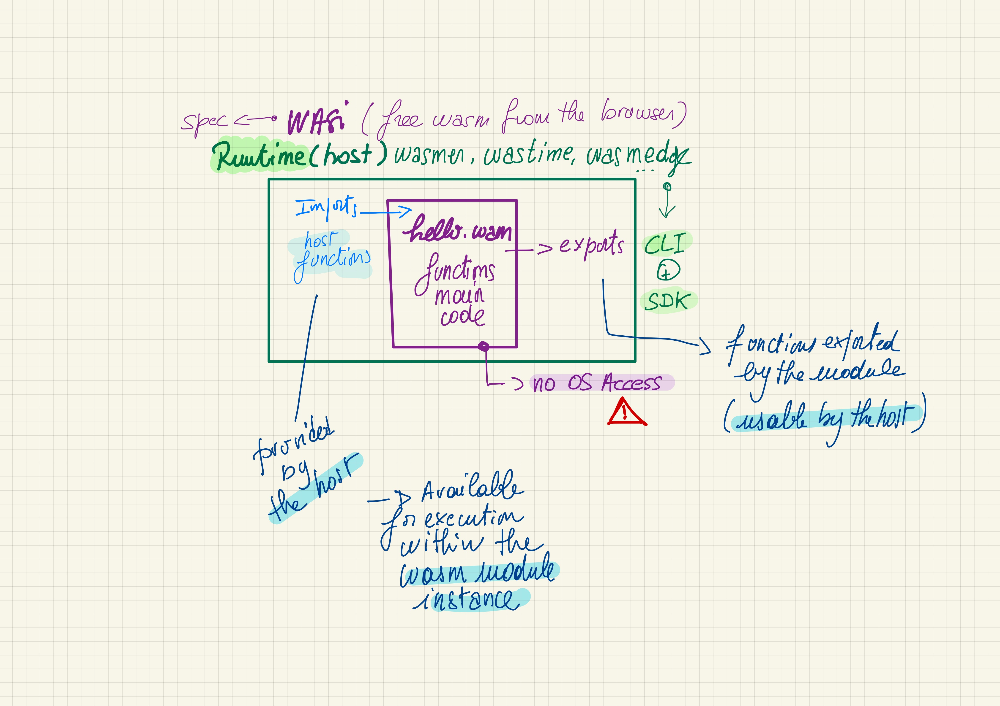


---

## Les projets de runtimes WASI

- Pour exécuter du code Wasm à partir d’une CLI
- Pour exécuter du code Wasm à partir d’un autre langage (Rust, Go, C/C++) >> SDK

---

## Les 3 les plus reconnus du moment :

- **Wasmer**: https://wasmer.io/
- **Wasmtime**: https://wasmtime.dev/
- **WasmEdge**: https://wasmedge.org/
---

##### SDK WASI / Langage <mark>(<> CLI)</mark>

<style scoped>
  mark {
    background-color: #17EFE7;
    color: #000000;
  }
  table {
      height: 80%;
      width: 100%;
      font-size: 20px;
      color: green;
  }
  th {
      color: blue;
  }
</style>

Langage             | WASMER                   | WASMEDGE (+arm)           | WASMTIME (+arm)
:-------------------|:-------------------------|:--------------------------|:--------
  <mark>Rust</mark> |  x                       |  x                        |  x
  <mark>Go</mark>   |  x (<mark>TinyGo</mark>) |  x  (<mark>TinyGo</mark>) |  x (<mark>TinyGo</mark>)
  <mark>C</mark>    |  x                       |  x                        |  x
  C++               |  x                       |                           |
  Python            |  x                       |  x                        |  x
  Swift             |  x                       |  x                        |  ?
  Grain             |                          |  x                        |  ?
  .Net              |  x (C#)                  |                           |  x
  NodeJS            |  x                       |  x                        |
  Bash              |                          |                           |  x
  Java              |  x                       |                           |  x (outside Bytecode Alliance)
  Perl              |                          |                           |  x (outside Bytecode Alliance)
  Zig               |  x (not published)       |                           |  x (outside Bytecode Alliance)
  Ruby              |                          |                           |  x (outside Bytecode Alliance)
> - Wasmer supporte d'autres langages
---
<style scoped>
  mark {
    background-color: #17EFE7;
    color: #000000;
  }
</style>

# Bytecode Alliance

https://bytecodealliance.org/

- WASM / WASI => les spécifications par le W3C,
- La Bytecode Alliance s’occupe de l’implémentation

Avec Amazon, ARM, <mark>Cosmonic</mark>, Fastly, Google, Intel, <mark>Fermyon</mark>, <mark>Suborbital</mark>, Microsoft, Mozilla, Shopify, Siemens ...

---


# Démos 🚀
## Les CLI des runtimes WASI

<a href="https://github.com/wasm-university/training/tree/main/13-go-wasi-cli-app" target="_blank">13-go-wasi-cli-app</a>
<a href="https://github.com/wasm-university/training/tree/main/14-rust-wasi-cli-function" target="_blank">14-rust-wasi-cli-function</a>


---

## Utiliser un SDK (WasmEdge)

#### Faites votre propre "CLI Wasm" 🤓

#### Appeler des fonctions Wasm à partir de Go 🚀

La documentation de WasmEdge est 💖
https://wasmedge.org/book/en/embed/go.html
https://github.com/second-state/WasmEdge-go-examples

---


# Démos 🚀
## Utilisation du SDK WasmEdge

<a href="https://github.com/wasm-university/training/tree/main/15-go-wasmedge-cli" target="_blank">15-go-wasmedge-cli</a>
<a href="https://github.com/wasm-university/training/tree/main/16-go-wasmedge-function" target="_blank">16-go-wasmedge-function</a>

<!-- montrer le code -->

---

## Utiliser le WASI SDK pour .NET Core

- Le **Wasi.Sdk** est expérimental
- Il permet de compiler des projets .NET Core en Wasm
- Il est aussi possible de faire des apps ASP.NET Core

---
<style scoped>
  mark {
    background-color: #17EFE7;
    color: #000000;
  }
</style>

### Application console

```bash
dotnet new console -o hello
cd hello
dotnet add package Wasi.Sdk --prerelease
dotnet build
```

<mark>16M bin/Debug/net7.0/hello.wasm</mark>

```bash
wasmtime bin/Debug/net7.0/hello.wasm
```
---
<style scoped>
  mark {
    background-color: #17EFE7;
    color: #000000;
  }
</style>

### Application ASP.Net

```bash
dotnet new web -o hello
cd hello
dotnet add package Wasi.Sdk --prerelease
dotnet add package Wasi.AspNetCore.Server.Native --prerelease
dotnet build
```

<mark>31M bin/Debug/net7.0/hello.wasm</mark>

```bash
wasmtime bin/Debug/net7.0/hello.wasm --tcplisten localhost:8080
```

---


# Démos 🚀
## Utilisation du SDK .Net

<a href="https://github.com/wasm-university/training/tree/main/17-dotnet-wasi-cli-app" target="_blank">17-dotnet-wasi-cli-app</a>
<a href="https://github.com/wasm-university/training/tree/main/18-dotnet-wasi-asp" target="_blank">18-dotnet-wasi-asp</a>

<!-- montrer le code -->
---
<style scoped>
  mark {
    background-color: #17EFE7;
    color: #000000;
  }
</style>
###  Ok, plutôt facile 😛
### Mais comment je fais si je veux passer une <mark>String</mark> à ma fonction ?


---


# Combattre les limitations
# De WASI (et Wasm)


---
<style scoped>
  mark {
    background-color: #17EFE7;
    color: #000000;
  }
</style>
# Des limitations

- **Système de type trop simple**
  - <mark>Seulement 4 types numériques</mark> :
    - Integers (32 & 64 bit)
    - Floats (32 & 64 bit)

- **Mode d’exécution fermé du module Wasm**
  - <mark>Pas d’accès à "l’extérieur"</mark> :
    - Pas d’appel http
    - Pas d’accès fichier
    - ...

---
<style scoped>
  mark {
    background-color: #17EFE7;
    color: #000000;
  }
</style>
## Mais : à venir

- **SIMD** : parallel computing
- **Threads** comme les Web Workers, gérés par le host
- **Exception Handling** : events + handler
- **ECMAScript Module Integration** : `import {foo} from "./myModule.wasm"`
- **Garbage Collection**
- <mark><b>Interface Types</b></mark> : décrire des types de plus haut niveau, éviter les frictions

https://hacks.mozilla.org/2019/08/webassembly-interface-types/

---


# Comment contourner ces limitations
### "the hard way"

---


# Passage de Strings à une fonction
### Avec WasmEdge

Pass complex parameters to Wasm functions:
https://wasmedge.org/book/en/embed/go/memory.html


---

# Inspiré d'un exemple
https://github.com/second-state/WasmEdge-go-examples/blob/master/go_MemoryGreet/greet_memory.go

---


<style scoped>
ul {
   font-size: 70%;
}
</style>

> 👋 fonctionnement

- Charger le module Wasm (par l'hôte)
- Copier la valeur de la string en mémoire
- Appeler la fonction Wasm en lui passant
  - le nom de la fonction
  - un pointeur sur la mémoire
- Côté fonction
  - Décoder le pointeur `Int32Ptr` en String
  - Exécuter la fonction (construire une nouvelle String)
  - Transformer la nouvelle String en pointeur `BytePtr` pour la retourner à l'hôte
- Côté hôte
  - Transformer le résultat en String
---


# Démo 🚀
## Passer une String à une fonction

<a href="https://github.com/wasm-university/training/tree/main/19-go-wasmedge-strings" target="_blank">19-go-wasmedge-strings</a>

<!-- montrer le code -->

---


# Host Functions
### Avec WasmEdge
#### 🖐️ on ne peut pas faire un fetch à partir d'un module wasm

https://wasmedge.org/book/en/extend/plugin/hostfunction.html#host-functions

---

# Inspiré d'un exemple

https://github.com/second-state/WasmEdge-go-examples/blob/master/go_HostFunc/hostfunc.go

Ça pique un peu ... 😢


---

###### Principe

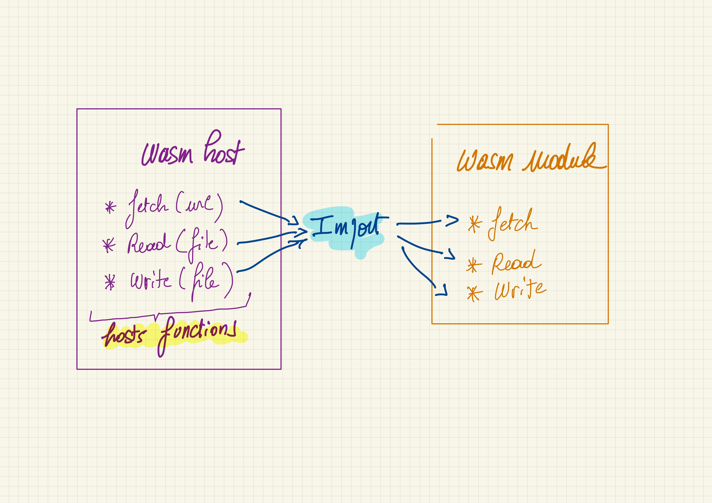


---


<style scoped>
ul {
   font-size: 100%;
}
</style>

### Comment ça marche

- Utiliser les fonctions hôtes d’un programme Go à partir d’un module wasm Rust

- Côté host :
  - Ecrire 2 hosts functions `fetch` & `writeMem`
  - Définir 2 nouveaux `FunctionType`
  - Les ajouter au module wasm
  - Lancer le tout 🚀

---


<style scoped>
ul {
   font-size: 100%;
}
</style>

### Comment ça marche

- Côté module wasm :
  - Référencer les fonctions
  ```rust
  extern "C" {
    fn fetch(url_pointer: *const u8, url_length: i32) -> i32;
    fn write_mem(pointer: *const u8);
  }
  ```
  - Et les utiliser

---


# Démo 🚀
## Host functions

<a href="https://github.com/wasm-university/training/tree/main/20-go-rust-host-function" target="_blank">20-go-rust-host-function</a>

<!-- montrer le code -->

---


# Comment contourner ces limitations
### "the soft 🤗 way"

---

# Sat
## Suborbital
### un SDK (?) au dessus des SDK


https://suborbital.dev/
<!--
https://github.com/suborbital/sat/issues/122
-->
---

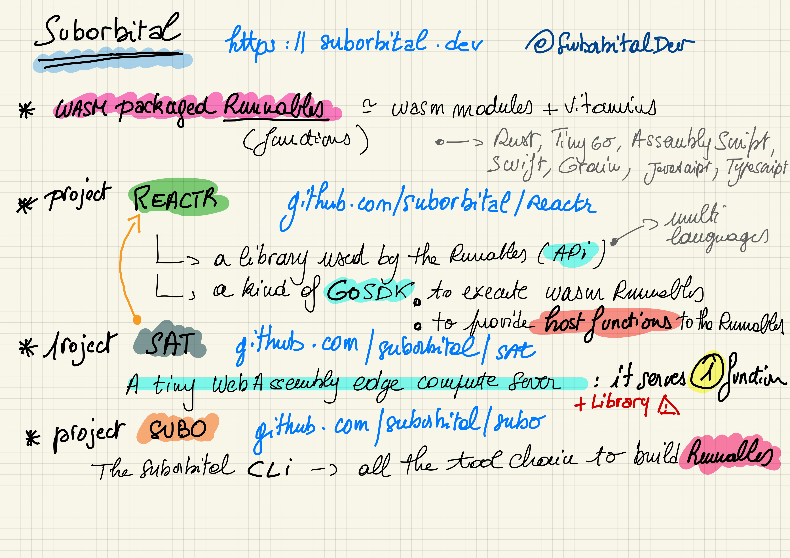


---

### Runnable(s)
<!-- polyglotes -->
`subo create runnable hello`
```rust
use suborbital::runnable::*;

struct Hello{}

impl Runnable for Hello {
  fn run(&self, input: Vec<u8>) -> Result<Vec<u8>, RunErr> {
    let in_string = String::from_utf8(input).unwrap();

    Ok(String::from(format!("hello {}", in_string)).as_bytes().to_vec())
  }
}
```

---

### Runnable(s) polyglottes
`subo create runnable hey --lang tinygo`
```go
package main

import (
	"github.com/suborbital/reactr/api/tinygo/runnable"
)

type Hey struct{}

func (h Hey) Run(input []byte) ([]byte, error) {
	return []byte("Hello, " + string(input)), nil
}
```

---

### Runnable(s) polyglottes
Go, Rust, mais aussi:
- AssemblyScript
- Swift (lent)
- Grain 😍
- JavaScript https://github.com/Shopify/javy
- TypeScript https://github.com/Shopify/javy

https://blog.suborbital.dev/bringing-javascript-and-typescript-to-suborbital

<!--
Introduction: Run your JavaScript on WebAssembly. Javy takes your JavaScript code, and executes it in a WebAssembly embedded JavaScript runtime.
-->
---

## Subo (toolchain)

```bash
subo create runnable hola --lang assemblyscript
cd hola
subo build .
```

---
<style scoped>
  mark {
    background-color: #17EFE7;
    color: #000000;
  }
</style>

### Sat (sdk mais pas que)
Embarquer du <mark>wasm</mark> dans vos applications <mark>Go</mark>

```go
wasmModuleConfig, _ := sat.ConfigFromRunnableArg("hello.wasm")
satFunction, _ := sat.New(wasmModuleConfig, nil)

result, err := satFunction.Exec([]byte("Bob"))
if err != nil {
  log.Fatal(err)
}

fmt.Println("🎉 " + string(result.Output))
```

---
<style scoped>
  mark {
    background-color: #F7C00E;
    color: #000000;
  }
</style>


# Démo(s) 🚀
### Une CLI "facile" avec Sat
#### <mark>Strings & Host Functions</mark>

<a href="https://github.com/wasm-university/training/tree/main/21-go-sat" target="_blank">21-go-sat</a>

---
<style scoped>
  mark {
    background-color: #FFFFFF;
    color: #000000;
  }
</style>

# Perspectives (Wasi & SDK)

- Write once, run anywhere (encore un peu de travail)
  - Runtimes multi-plateformes
- Applications (CLI ou autre) avec plugins wasm
- "Lanceurs/Serveurs" de modules wasm
  - <mark>**Sécurité** 🖐️</mark>
  - Activation/Ajout de fonctionnalités
  - Bots, Hooks, FaaS, UDF, ...


---
<style scoped>
  mark {
    color: #44F099;
  }
</style>


# MicroServices, FaaS, ...
### <mark>Avec WebAssembly</mark>

<!--
- Utiliser d'autres langages (ex Grain)
- Parler des tests de charges
-->
---

# Wagi

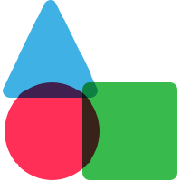
https://deislabs.io/

- **WAGI**: WebAssembly Gateway Interface https://github.com/deislabs/wagi
- **Hippo**, the WebAssembly PaaS https://github.com/deislabs/hippo

---

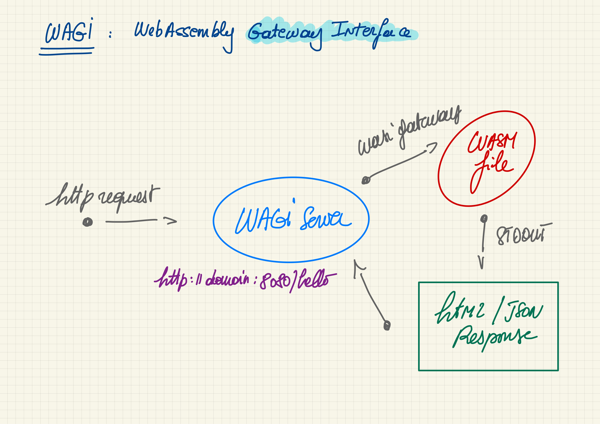


---

```go
package main

import "fmt"

func main() {
	fmt.Println("content-type: text/plain;utf-8")
	fmt.Println("")
	fmt.Println("👋 Hello World 🌍")
}
```
> GET
```bash
curl http://localhost:3000/hello
```
---

# Spin


https://www.fermyon.com/


https://spin.fermyon.dev/


---

### Spin
##### L'évolution de Wagi | Rust & Go (mais pas que)

- Micro Service https://www.wasm.builders/fermyon/a-one-line-microservice-with-spin-33ke
- Bartholomew MicroCMS https://github.com/fermyon/bartholomew
- Kitchensink https://github.com/fermyon/spin-kitchensink

---

##### Spin service en Go (TinyGo)

```go
package main

import (
 "fmt"
 "net/http"

 spinhttp "github.com/fermyon/spin/sdk/go/http"
)

func init() {
 spinhttp.Handle(func(w http.ResponseWriter, r *http.Request) {
  w.Header().Set("Content-Type", "text/plain")
  fmt.Fprintln(w, "Hello Fermyon!")
 })
}

func main() {}
```

---

# Sat 😍


---

# Sat
Pas uniquement une librairie, mais aussi un serveur http
- À base de "**Runnables**"
- Multi langages
  - Rust, Go, AssemblyScript, Grain, Swift, JavaScript, TypesSript)
- Facile à utiliser

---

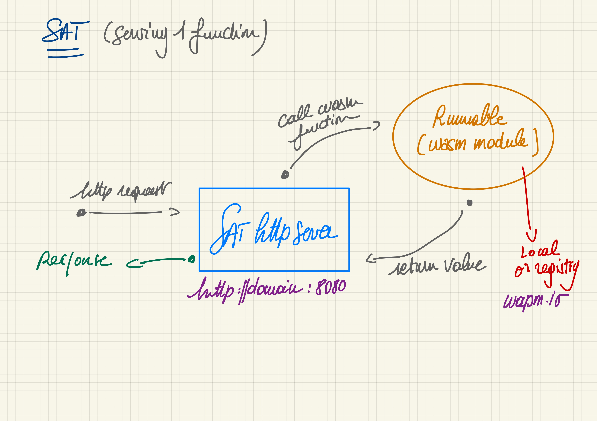


---

##### Sat [Swift]
`subo create runnable yo --lang swift`

```swift
import Suborbital

class Yo: Suborbital.Runnable {
    func run(input: String) -> String {
        return "hello " + input
    }
}

Suborbital.Set(runnable: Yo())
```

---

### Build, Run
#### Serverless function

`subo build yo`
`SAT_HTTP_PORT=8080 sat ./yo/yo.wasm`
`curl -d "Bob Morane" http://localhost:8080`

https://www.wasm.builders/suborbital/a-simple-data-hashing-serverless-function-using-sat-3fn0

---

#### Wapm.io (Wasmer)
Wasm registry

`SAT_HTTP_PORT=8080 sat https://registry-cdn.wapm.io/contents/k33g/forty-two/1.0.0/forty-two.wasm`

https://www.wasm.builders/k33g_org/publish-your-runnables-on-wapmio-49k0

---

#### Fly.io
Caas | Déploiement ultra simple

https://www.wasm.builders/k33g_org/deploy-a-sat-serverless-function-with-to-flyio-35df

---

# Wasm Cloud


https://cosmonic.com/

---

# Wasm Cloud
https://cosmonic.com/ | https://wasmcloud.com/

Une plateforme + un SDK + un Runtime
- Nats (communications) https://docs.nats.io/
- Système à base d'acteurs

---
<style scoped>
code {
   font-size: 60%;
}
</style>

##### Wasm Cloud [Rust]

`wash new actor hello --template-name hello`

```rust
/// Implementation of HttpServer trait methods
#[async_trait]
impl HttpServer for HelloActor {

    async fn handle_request(&self, _ctx: &Context, req: &HttpRequest,) -> std::result::Result<HttpResponse, RpcError> {
        let text = ...;

        Ok(HttpResponse {
            body: format!("Hello {}", text).as_bytes().to_vec(),
            ..Default::default()
        })
    }
}
```

---

<style scoped>
code {
   font-size: 60%;
}
</style>

##### Wasm Cloud [TinyGo]

`wash new actor hello --template-name echo-tinygo`

```go
func main() {
	me := Hey{}
	actor.RegisterHandlers(httpserver.HttpServerHandler(&me))
}

type Hey struct{}

func (e *Hey) HandleRequest(ctx *actor.Context, req httpserver.HttpRequest) (*httpserver.HttpResponse, error) {
	r := httpserver.HttpResponse{
		StatusCode: 200,
		Header:     make(httpserver.HeaderMap, 0),
		Body:       []byte("hello"),
	}
	return &r, nil
}
```
---

<style scoped>
  mark {
    background-color: #F7C00E;
    color: #000000;
  }
</style>


# Démo(s) 🚀

<a href="https://github.com/wasm-university/training/tree/main/22-wagi" target="_blank">22-wagi</a>
<a href="https://github.com/wasm-university/training/tree/main/23-spin" target="_blank">23-spin</a>
<a href="https://github.com/wasm-university/training/tree/main/24-sat" target="_blank">24-sat</a>

---

<style scoped>
  mark {
    color: #44F099;
  }
</style>


# Et après ?
### <mark>Le futur de WebAssembly</mark> 👀


---
<style scoped>
ul {
   font-size: 70%;
}
</style>
##### À suivre https://github.com/WebAssembly
*Juin 2022 :*
- https://github.com/WebAssembly/component-model
  - amélioration intégration host
  - activité (GitHub Insights) en début d'année et un peu récemment
- https://github.com/WebAssembly/interface-types
  - reporté dans component-model
- https://github.com/WebAssembly/exception-handling
  - grosse activité en début d'année
- https://github.com/WebAssembly/debugging
  - 💀 😢
- https://github.com/WebAssembly/wasi-filesystem
  - un peu d'activité récemment


---
<style scoped>
  mark {
    color: #44F099;
  }
</style>


# Merci 😃

## <mark>Questions ?<mark>
---
